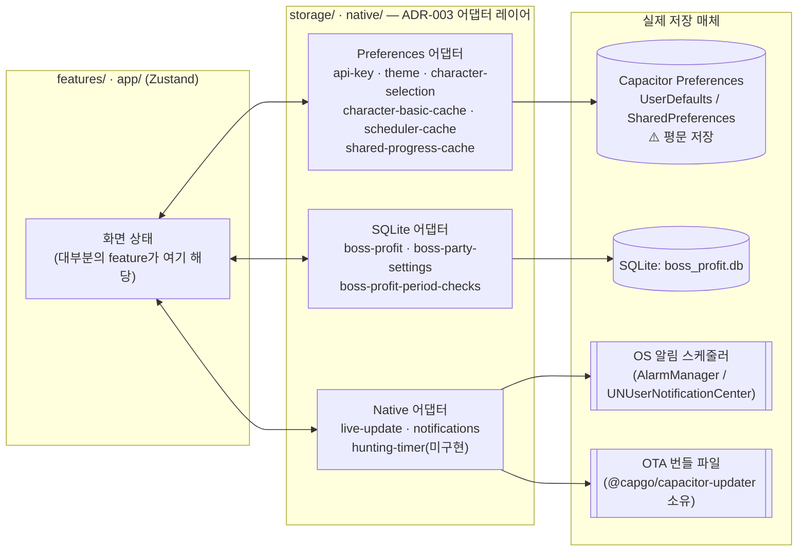

# 영속 데이터 지도

이 디렉토리는 메이플 루틴 앱이 기기에 **영속적으로(재실행·재부팅 후에도 남게)** 저장하는 모든 데이터를 정리한다. 백엔드가 없는 구조([[ADR-003]])라 여기 정리된 것이 앱이 가진 데이터의 전부다.

- [preferences.md](./preferences.md) — Key-Value 저장소(Capacitor Preferences) 전체 키 목록
- [sqlite.md](./sqlite.md) — SQLite `boss_profit.db` 스키마
- [lifecycle.md](./lifecycle.md) — 데이터가 언제 생성·갱신·삭제되는지 (온보딩, 캐시 삭제, 연결 해제, OTA 리로드)

## 왜 3개 물리 저장소로 나뉘는가

| 저장소 | 무엇을 담당 | 형태 |
|---|---|---|
| **Capacitor Preferences** | 대부분의 데이터. 인증, 테마, 동기화 캐시, 사용자 기록 원장 | 평문 Key-Value (iOS UserDefaults / Android SharedPreferences) |
| **SQLite (`boss_profit.db`)** | 보스 수익 관련 데이터만 | 관계형 테이블 3개 |
| **네이티브 OS 레벨** | 로컬 알림 예약, OTA 번들 파일 | 앱 코드가 직접 읽지 못하는 OS/플러그인 소유 저장소 |

보스 수익만 SQLite인 이유는 "기간별 기록이 누적되고, (ocid, boss, difficulty, period_key) 같은 복합키로 조회·upsert가 잦다"는 특성 때문이다. 나머지는 대부분 "캐릭터 하나당 JSON 덩어리 하나" 형태라 Key-Value로 충분하다.

## 전체 계층 구조

`features/*` 코드는 로컬 저장소·네이티브 API에 직접 접근하지 않고 반드시 `storage/`·`native/` 어댑터를 거친다([[ADR-003]], [[ADR-005]]). 어댑터 하나가 물리 저장소 하나의 특정 부분만 책임진다.

이 레이어링 덕분에 (1) feature 코드는 Capacitor API를 몰라도 되고, (2) 물리 저장소를 바꾸더라도 어댑터 내부만 교체하면 된다.

## 데이터 성격별 3분류

| 분류 | 예시 | 특징 |
|---|---|---|
| **인증/설정** | `apiKey`, `selectedAccountId`, `theme` | 사용자가 명시적으로 설정. "캐시 데이터 삭제"에도 보존됨 |
| **동기화 캐시** | 스케줄러 상태, 캐릭터 기본 정보, 공유 진행 원장 | Nexon API 응답을 로컬에 미러링. 서버가 진실이고 이건 stale-while-revalidate용 사본([[ADR-016]]) |
| **로컬 전용 기록** | 보스 수익 기록, 파티 설정, 기간 체크 | Nexon API에 없는, 사용자가 이 앱에서만 남기는 값. 서버 재동기화로 복구 불가 |

## 영속 데이터가 "아닌" 것

혼동하기 쉬운 인접 개념들을 명확히 구분한다.

- **`src/data/*.json` (게임 레퍼런스 데이터)**: 보스 목록, 결정 가격표, 드랍 테이블 등. 앱 번들에 정적으로 포함되는 **읽기 전용 참조 데이터**이지 사용자별 영속 데이터가 아니다. 사용자 기기마다 값이 달라지지 않고, 앱 업데이트로만 바뀐다. AI가 임의로 값을 추정해 넣지 않고 반드시 사용자 확인을 거친다([[ADR-006]]) — 이 문서의 범위 밖.
- **Zustand 스토어 자체**: `features/*/store.ts`의 in-memory 상태는 저장소가 아니라 저장소를 읽어 들인 **런타임 캐시**다. 앱을 완전히 종료하면 사라지고, 다음 실행 시 아래 어댑터에서 다시 채워진다(전부는 아님 — [lifecycle.md](./lifecycle.md)의 "부팅 시 하이드레이션" 참고).
- **사냥 타이머 네이티브 플러그인**: `native/hunting-timer`는 인터페이스만 정의돼 있고 실제 Android Foreground Service / iOS Live Activity 구현은 아직 없다([[ADR-005]], 별도 task). 현재 web 폴백(`hunting-timer.web.ts`)은 메모리 변수라 새로고침하면 사라지며, 어떤 feature도 아직 이 플러그인을 소비하지 않는다.
