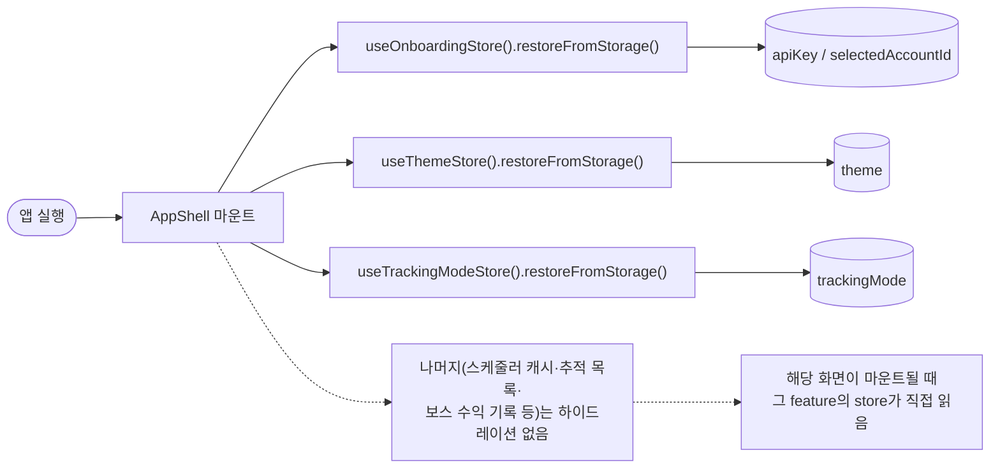
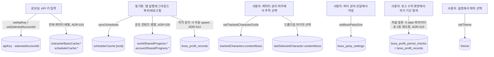
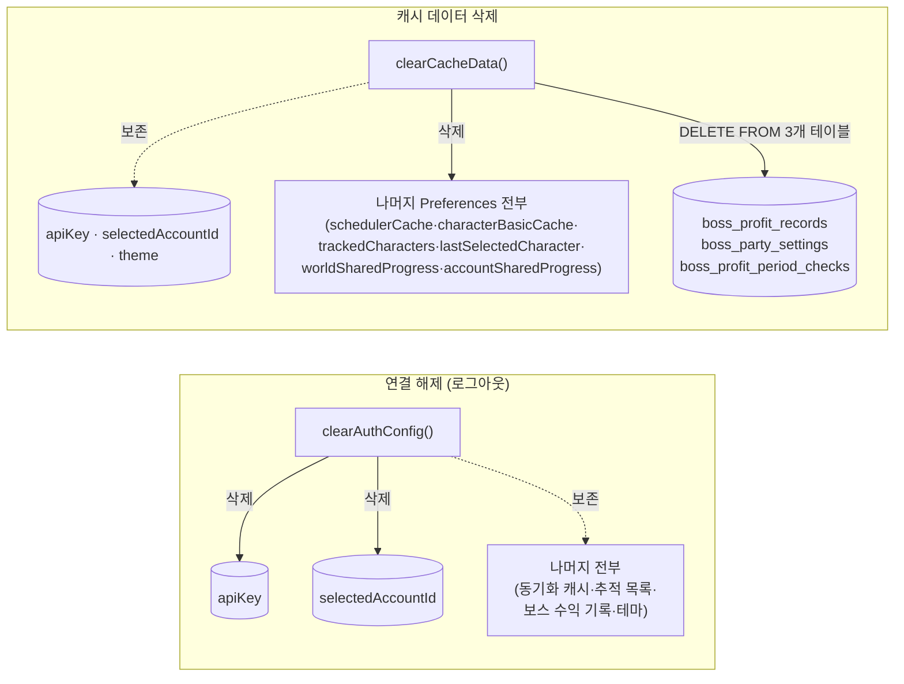

# 데이터 생명주기

각 데이터가 언제 생기고, 언제 갱신되고, 어떤 사용자 액션으로 지워지는지 정리한다. 전체 생성 흐름의 서사적 설명은 `docs/ARCHITECTURE.md`의 "데이터 흐름" 절이 더 상세하다 — 이 문서는 "지금 이 시점에 무엇이 어디에 있는가"를 빠르게 확인하는 용도다.

## 부팅 시 하이드레이션

앱을 완전히 종료했다 다시 열면 Zustand 스토어는 비어 있는 상태로 시작한다. `AppShell`(`src/App.tsx`)이 마운트되며 **딱 세 가지만** 즉시 복원한다.

스케줄러 캐시, 추적 캐릭터 목록, 보스 수익 기록 등은 부팅 시 미리 읽어두지 않는다 — 예를 들어 `features/boss-profit/store.ts`는 보스 수익 화면에 실제로 들어갔을 때 비로소 `storage/scheduler-cache`·`storage/boss-profit` 등을 읽는다. 화면에 한 번도 들어가지 않으면 그 데이터는 계속 저장소에만 있고 메모리로 올라오지 않는다.

## 쓰기가 일어나는 시점

이 중 어떤 값도 TTL(자동 만료) 없이 계속 남는다 — 삭제되는 경로는 아래 두 사용자 액션뿐이다.

## 삭제 범위: 연결 해제 vs 캐시 데이터 삭제

설정 화면에는 성격이 전혀 다른 두 개의 삭제 액션이 있다. 이름이 비슷해 보이지만 지우는 범위가 정반대에 가깝다.

| | 연결 해제 | 캐시 데이터 삭제 |
|---|---|---|
| 어디서 | 설정 → 연결 해제 | 설정 → 데이터 관리 → 캐시 데이터 삭제 |
| 구현 | `storage/api-key.ts`의 `clearAuthConfig()` + `features/onboarding`의 `RESET` 이벤트 | `storage/cache-data.ts`의 `clearCacheData()` |
| 지우는 것 | `apiKey`, `selectedAccountId` **딱 2개 키만** | `KEEP_KEYS`(`apiKey`/`selectedAccountId`/`theme`) 제외 **모든 Preferences 키** + SQLite 3개 테이블 전체 행 |
| 보스 수익 기록 | 그대로 유지 | **영구 삭제** (서버에 없는 로컬 전용 데이터라 복구 불가) |
| 결과 | 온보딩 화면으로 돌아감 | 같은 계정으로 계속 쓰되, 모든 로컬 기록·캐시가 초기화된 상태로 리로드 |
| 의도 | "다른 계정으로 전환" | "저장 공간 확보 / 상태 초기화" — 참조 무결성 보존이 목적이 아니라 명시적 초기화 |

`clearCacheData()`는 SQLite 테이블을 `DROP`이 아니라 `DELETE FROM`으로 비운다 — 스키마(테이블 자체)는 남고 행만 사라진다.

설정 화면의 "캐시 데이터 삭제" 행 옆에는 `getCacheDataSize()`가 계산한 근사 용량(바이트)이 표시된다 — `clearCacheData()`가 지우는 것과 정확히 같은 범위(`KEEP_KEYS` 제외 Preferences 값 + 저 3개 테이블의 모든 셀)만 합산한 값이다.

## 리로드를 동반하는 삭제 — SQLite 커넥션 처리

캐시 데이터 삭제는 `window.location.reload()`로 마무리된다. 이때도 [sqlite.md](./sqlite.md)의 "커넥션 라이프사이클"과 동일하게 리로드 직전 `closeBossProfitDb()`를 호출해야 한다 — `app/settings/CacheDataSection.tsx`의 `handleClear()`가 삭제 → 스플래시 표시 → `closeBossProfitDb()` → 리로드 순서를 지킨다. 삭제 자체가 실패하거나(reject) 네이티브 호출이 응답 없이 멈추는 경우까지 대비해 10초 타임아웃과 경쟁시킨 뒤 항상 리로드로 마무리한다.

## 네이티브 OS 레벨 영속 데이터

이 두 가지는 `storage/`를 거치지 않고 OS·서드파티 플러그인이 직접 소유한다 — 앱 코드가 임의로 조회·백업할 수 없다.

- **로컬 알림 예약** (`native/notifications.ts`): `LocalNotifications.schedule()`로 등록한 예약은 OS(Android AlarmManager / iOS `UNUserNotificationCenter`)가 직접 들고 있다. 앱은 예약 개수(`getPendingNotificationCount()`)만 조회할 수 있고, 개별 예약 내용을 다시 읽어올 방법은 없다.
- **OTA 번들 파일** (`native/live-update.ts`): `@capgo/capacitor-updater`가 다운로드한 번들 zip은 플러그인이 자체 관리하는 네이티브 파일 저장소에 있다. 앱 코드는 `CapacitorUpdater.current()`로 "지금 이 버전이 적용돼 있다"는 메타데이터만 조회하며, 파일 자체의 존재/삭제는 플러그인 책임이다. `applyDownloadedLiveUpdate()`(번들 전환)와 캐시 데이터 삭제 둘 다 SQLite 커넥션을 먼저 닫아야 하는 동일한 리로드 패턴을 쓴다.

두 저장소 모두 "캐시 데이터 삭제"의 삭제 범위에 포함돼 있지 않다 — 캐시 삭제 후에도 예약된 알림과 현재 적용된 OTA 번들은 그대로 남는다.
