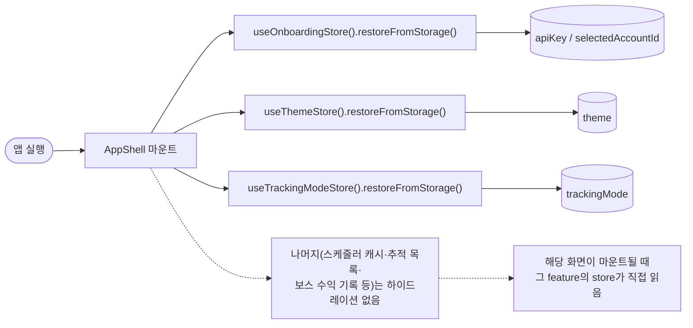
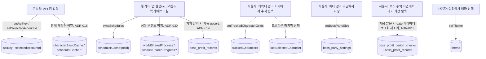
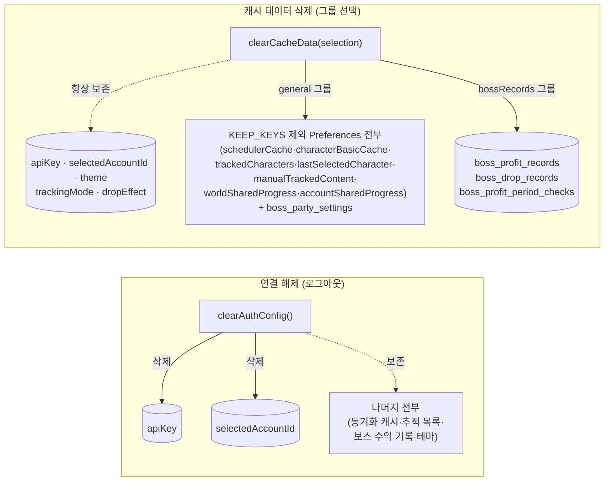

# 데이터 생명주기

각 데이터가 언제 생기고, 언제 갱신되고, 어떤 사용자 액션으로 지워지는지 정리한다. 전체 생성 흐름의 서사적 설명은 `docs/ARCHITECTURE.md`의 "데이터 흐름" 절이 더 상세하다 — 이 문서는 "지금 이 시점에 무엇이 어디에 있는가"를 빠르게 확인하는 용도다.

## 부팅 시 하이드레이션

앱을 완전히 종료했다 다시 열면 Zustand 스토어는 비어 있는 상태로 시작한다. `AppShell`(`src/App.tsx`)이 마운트되며 **딱 세 가지만** 즉시 복원한다.

```mermaid
flowchart LR
    Start([앱 실행]) --> Shell[AppShell 마운트]
    Shell --> A["useOnboardingStore().restoreFromStorage()"]
    Shell --> B["useThemeStore().restoreFromStorage()"]
    Shell --> C["useTrackingModeStore().restoreFromStorage()"]
    A --> P1[("apiKey / selectedAccountId")]
    B --> P2[("theme")]
    C --> P3[("trackingMode")]
    Shell -.-> Lazy["나머지(스케줄러 캐시·추적 목록·\n보스 수익 기록 등)는 하이드레이션 없음"]
    Lazy -.-> Screen["해당 화면이 마운트될 때\n그 feature의 store가 직접 읽음"]
```

스케줄러 캐시, 추적 캐릭터 목록, 보스 수익 기록 등은 부팅 시 미리 읽어두지 않는다 — 예를 들어 `features/boss-profit/store.ts`는 보스 수익 화면에 실제로 들어갔을 때 비로소 `storage/scheduler-cache`·`storage/boss-profit` 등을 읽는다. 화면에 한 번도 들어가지 않으면 그 데이터는 계속 저장소에만 있고 메모리로 올라오지 않는다.

## 쓰기가 일어나는 시점

```mermaid
flowchart TD
    Onboard["온보딩: API 키 입력"] -->|setApiKey / setSelectedAccountId| Pref1[("apiKey · selectedAccountId")]
    Onboard -->|전체 캐릭터 예열, ADR-016| Pref2[("characterBasicCache:*\nschedulerCache:*")]

    Sync["동기화: 앱 실행/포그라운드 복귀/새로고침"] -->|syncSchedules| Pref3[("schedulerCache:{ocid}")]
    Sync -->|공유 콘텐츠 병합, ADR-030| Pref4[("worldSharedProgress:*\naccountSharedProgress:*")]
    Sync -->|처치 감지 시 자동 upsert, ADR-014| Sql1[("boss_profit_records")]

    UserPick["사용자: 캐릭터 관리 피커에서 추적 선택"] -->|setTrackedCharacterOcids| Pref5[("trackedCharacters")]
    UserPick -->|드롭다운 마지막 선택| Pref6[("lastSelectedCharacter")]

    UserParty["사용자: 파티 관리 모달에서 저장"] -->|setBossPartySize| Sql2[("boss_party_settings")]

    UserPeriod["사용자: 보스 수익 화면에서 과거 기간 탐색"] -->|처음 방문 시 date 파라미터로 1회 재조회, ADR-023| Sql3[("boss_profit_period_checks\n+ boss_profit_records")]

    UserTheme["사용자: 설정에서 테마 선택"] -->|setTheme| Pref7[("theme")]
```

이 중 어떤 값도 TTL(자동 만료) 없이 계속 남는다 — 삭제되는 경로는 아래 두 사용자 액션뿐이다.

## 삭제 범위: 연결 해제 vs 캐시 데이터 삭제

설정 화면에는 성격이 전혀 다른 두 개의 삭제 액션이 있다. 이름이 비슷해 보이지만 지우는 범위가 정반대에 가깝다.

```mermaid
flowchart LR
    subgraph Logout["연결 해제 (로그아웃)"]
        direction TB
        D1["clearAuthConfig()"]
        D1 -->|삭제| X1[("apiKey")]
        D1 -->|삭제| X2[("selectedAccountId")]
        D1 -.보존.-> K1["나머지 전부\n(동기화 캐시·추적 목록·\n보스 수익 기록·테마)"]
    end

    subgraph CacheClear["캐시 데이터 삭제 (그룹 선택)"]
        direction TB
        D2["clearCacheData(selection)"]
        D2 -.항상 보존.-> K2[("apiKey · selectedAccountId · theme\ntrackingMode · dropEffect")]
        D2 -->|general 그룹| Y1["KEEP_KEYS 제외 Preferences 전부\n(schedulerCache·characterBasicCache·\ntrackedCharacters·lastSelectedCharacter·\nmanualTrackedContent·\nworldSharedProgress·accountSharedProgress)\n+ boss_party_settings"]
        D2 -->|bossRecords 그룹| Y2[("boss_profit_records\nboss_drop_records\nboss_profit_period_checks")]
    end
```

두 그룹은 각각 끄고 켤 수 있다([[ADR-058]]) — 용량 대부분을 차지하는 동기화 캐시만 비우고 **복구 불가능한 수익·드롭 기록은 남기는** 선택이 가능하다. 아래 표의 "지우는 것"은 두 그룹을 모두 선택했을 때(기본값)의 범위다.

| | 연결 해제 | 캐시 데이터 삭제 |
|---|---|---|
| 어디서 | 설정 → 연결 해제 | 설정 → 데이터 관리 → 캐시 데이터 삭제 |
| 구현 | `storage/api-key.ts`의 `clearAuthConfig()` + `features/onboarding`의 `RESET` 이벤트 | `storage/cache-data.ts`의 `clearCacheData()` |
| 지우는 것 | `apiKey`, `selectedAccountId` **딱 2개 키만** | `KEEP_KEYS`(`apiKey`/`selectedAccountId`/`theme`/`trackingMode`/`dropEffect`, 5개) 제외 **모든 Preferences 키** + **`db.ts`가 정의한 모든 SQLite 테이블**의 전체 행 |
| 보스 수익 기록 | 그대로 유지 | **영구 삭제** (서버에 없는 로컬 전용 데이터라 복구 불가) |
| 결과 | 온보딩 화면으로 돌아감 | 같은 계정으로 계속 쓰되, 모든 로컬 기록·캐시가 초기화된 상태로 리로드 |
| 의도 | "다른 계정으로 전환" | "저장 공간 확보 / 상태 초기화" — 참조 무결성 보존이 목적이 아니라 명시적 초기화 |

`clearCacheData()`는 SQLite 테이블을 `DROP`이 아니라 `DELETE FROM`으로 비운다 — 스키마(테이블 자체)는 남고 행만 사라진다.

설정 화면의 "캐시 데이터 삭제" 행 옆에는 근사 용량(바이트)이 표시된다 — `getCacheDataSizes()`가 계산한 **그룹별 용량의 합**이며, 각 그룹 값은 그 그룹이 실제로 지우는 것과 정확히 같은 범위(해당 Preferences 값 + 해당 테이블의 모든 셀)만 합산한다.

### 삭제 그룹은 2개다 ([[ADR-058]])

| 그룹 | 모달 표기 | 범위 | 복구 |
|---|---|---|---|
| `general` | 일반 데이터 | `KEEP_KEYS` 제외 **모든** Preferences 키 + `BOSS_PROFIT_TABLE_NAMES` **−** `bossRecords` 테이블(현재 `boss_party_settings`) | 캐시는 재동기화로 복구. 추적 목록·수동 추적 항목은 **재선택 필요** |
| `bossRecords` | 보스 수익·드롭 기록 | `boss_profit_records` · `boss_drop_records` · `boss_profit_period_checks` | **복구 불가** |

**그룹 정의는 열거가 아니라 차집합이다** — 명시 목록을 갖는 쪽은 `bossRecords`뿐이고 `general`은 "나머지 전부"로 파생된다. 그래서 새 Preferences 키도, `db.ts`에 추가된 새 SQLite 테이블도 **자동으로 `general`에 편입돼** 계속 삭제 대상으로 남는다. 두 그룹을 모두 열거식으로 정의했다면 어느 그룹에도 안 잡히는 데이터가 생기고, 그건 [[ADR-052]]가 없앤 "새 저장소가 삭제 목록에서 누락된다"는 결함이 부호만 뒤집힌 형태다.

경계에 있는 두 테이블의 소속에는 이유가 있다.

- **`boss_profit_period_checks`가 `bossRecords`에 있는 이유** — 이 표식 자체는 재조회로 복구되지만, `general`에 뒀다면 "수익 기록은 지우고 표식은 남기는" 조합이 가능해진다. `loadPeriod`가 `isPeriodChecked()`로 백필 대상을 거르므로([[ADR-023]]), 그 상태에서는 NEXON API가 아직 제공하는 **최근 2주치를 다시 긁어올 경로마저 막힌다.**
- **`boss_party_settings`가 `general`에 있는 이유** — 기록이 아니라 설정이고, 어느 쪽으로 지워도 위험한 조합이 없다. 파티 인원은 저장 시점에 `boss_profit_records.party_size`로 복사되므로 설정을 지워도 이미 기록된 정산액은 바뀌지 않는다.
- **수익과 드롭을 더 쪼개지 않는 이유** — `boss_profit_records`만 지우고 `boss_drop_records`가 남으면 고아 드롭 행이 되어, 같은 캐릭터가 같은 보스를 같은 기간에 다시 잡을 때 예전 드롭이 되살아나 붙는다([[ADR-052]]). 이 조합을 UI 경고가 아니라 **그룹 경계로** 막는다.

확인 모달(`app/settings/CacheClearConfirm.tsx`)은 이 두 그룹을 체크박스 2행으로 보여주고(기본 전체 체크), 각 행에 그룹 용량을, `bossRecords` 행에 복구 불가 경고를 붙인다. **보존되는 `KEEP_KEYS` 5개는 모달에 나열하지 않는다**([[ADR-058]] 결정 9로 [[ADR-052]] 결정 3의 "유지됨" 줄 폐기) — 삭제되는 데이터는 전부 둘 중 한 그룹에 속하므로, 체크를 풀면 그 그룹이 남는다는 것이 화면 구조로 드러난다.

각 행 아래 항목 문구("캐릭터 정보 · 수동 선택 항목 · 파티 보스 설정 등")는 **대표 항목만 적은 요약**이다([[ADR-058]] 결정 10) — 스케줄 캐시·공유 진행 원장·마지막 선택 캐릭터·기간 조회 기록처럼 문구에 없는 것도 같은 그룹으로 함께 지워진다. **삭제 범위의 기준은 위 표이지 모달 문구가 아니다.**

### 삭제 대상 테이블 목록은 `db.ts` 하나에서만 나온다 ([[ADR-052]] 결정 2)

`clearCacheData()`/`getCacheDataSize()`가 도는 테이블 목록은 **`storage/sqlite/db.ts`의 테이블 정의 배열**(`[{ name, createSql }]`)이 단일 진실 공급원이다. `openBossProfitDb()`의 `CREATE TABLE` 실행도 같은 배열을 순회하고, `cache-data.ts`는 그 이름 배열을 import해서 쓴다 — 삭제 목록이 코드상 한 곳뿐이라 스키마와 갈라질 자리가 없다.

**그래서 새 테이블을 추가할 때 삭제 목록을 따로 손댈 필요가 없다** — `db.ts`의 배열에 항목 하나를 넣으면 스키마 생성·캐시 삭제 범위·용량 계산에 전부 자동 반영된다. 이 규칙이 없던 시절 [[ADR-038]]의 `boss_drop_records`가 `cache-data.ts`의 하드코딩 목록에만 누락돼, 캐시를 지워도 드롭 기록이 남고 표시 용량이 실제보다 작게 나오는 결함이 있었다(수익 기록만 지워지고 드롭이 남으면 같은 보스를 다시 잡을 때 예전 드롭이 되살아나 붙는다).

### 캐시 삭제 후 수동 트래킹 모드는 어떻게 복구되나 ([[ADR-035]] 결정 14(b))

`trackingMode`는 보존되지만 **그 모드가 소비하는 데이터는 남지 않는다** — 추적 캐릭터 목록(`trackedCharacters`)도, 캐릭터별 수동 추적 항목(`manualTrackedContent:{ocid}`)도 다른 Preferences 키와 함께 지워진다. 그래서 캐시 삭제 직후에는 "수동 모드인데 추적 중인 캐릭터도, 체크할 항목도 없는" 상태가 잠깐 생긴다.

이 상태의 복구 경로는 **끊겨 있지 않고, 별도 마이그레이션 없이 기존 흐름으로 회복된다**. 부팅 시 `AppShell`이 `trackingMode`를 복원하고(위 "부팅 시 하이드레이션"), 사용자가 캐릭터 관리 피커에서 캐릭터를 다시 선택해 저장하면 `features/content-scheduler/store.ts`·`features/boss-scheduler/store.ts`의 [[ADR-035]] 결정 14(b) 분기가 탄다 — 저장 시점의 이전 추적 목록이 비어 있으므로(`previousOcids = []`) 선택한 캐릭터 **전원이 "새로 추가된" 것으로 판정돼** `seedManualTrackedContent`가 돌고 `manualTrackedContent:{ocid}`가 다시 만들어진다. 즉 수동 모드 사용자는 캐릭터만 다시 고르면 원래대로 돌아온다.

돌아오지 않는 것은 **사용자가 손댄 부분**이다. 시드는 템플릿([[ADR-035]] 결정 7·11) 기준이라, 사용자가 개별 항목을 빼거나 `maxCount`를 조정해둔 커스터마이즈는 템플릿 기본값 상태로 초기화된다. 반면 체크 상태·진행값은 애초에 `manualTrackedContent`가 아니라 `schedulerCache`에서 조회하므로([[ADR-035]] 결정 6) 다음 동기화로 다시 채워진다.

## 리로드를 동반하는 삭제 — SQLite 커넥션 처리

캐시 데이터 삭제는 `window.location.reload()`로 마무리된다. 이때도 [sqlite.md](./sqlite.md)의 "커넥션 라이프사이클"과 동일하게 리로드 직전 `closeBossProfitDb()`를 호출해야 한다 — `features/settings/cache-data.ts`의 `clearCacheDataAndReload()`가 삭제 → **`closeBossProfitDb()` → 스플래시 표시** → 리로드 순서를 지킨다. 삭제 자체가 실패하거나(reject) 네이티브 호출이 응답 없이 멈추는 경우까지 대비해 10초 타임아웃과 경쟁시킨 뒤 항상 리로드로 마무리한다.

**커버(스플래시)가 닫기 뒤로 간 것은 2026-08-08 이다** ([[ADR-117]] 결정 8) — 먼저 올리면 닫기가 매달리는 동안 사용자가 브랜드색 화면에 갇히고 iOS 에서는 터치까지 죽는다(이슈 #175 의 OTA 적용과 같은 결함의 두 번째 자리였다). 닫기 자체에도 5초 상한이 생겼다(같은 ADR 결정 5, [sqlite.md](./sqlite.md)) — 여전히 던지지 않으므로 이 경로에 새 실패 분기는 없다.

## 네이티브 OS 레벨 영속 데이터

이 두 가지는 `storage/`를 거치지 않고 OS·서드파티 플러그인이 직접 소유한다 — 앱 코드가 임의로 조회·백업할 수 없다.

- **로컬 알림 예약** (`native/notifications.ts`): `schedule()`로 등록한 예약은 OS(Android AlarmManager / iOS `UNUserNotificationCenter`)가 직접 들고 있다. 앱은 예약 개수(`getPendingNotificationCount()`)만 조회할 수 있고, 개별 예약 내용을 다시 읽어올 방법은 없다.
  - **그래서 «무엇을 예약해 뒀는지» 는 우리가 따로 적는다** — `notificationLedger`(Preferences, [[ADR-146]] 결정 5). 이 원장이 없으면 OTA 로 알림 종류를 뺐을 때 그 예약을 **이름으로 지목해 취소할 방법이 없어** 유령 알림으로 남는다(`../migration/data.md` 결정 4 가 프레임워크 전환에서 겪은 것과 같은 사고이고, 이번엔 OTA 마다 일어날 수 있었다). 원장은 OS 를 **읽는** 수단이 아니라 **우리가 쓴 것을 기억하는** 수단이라, 둘이 어긋나는 창은 결정적 id + 멱등 재조정이 다음 회차에 흡수한다.
- **OTA 번들 파일** (`native/live-update.ts`): `expo-updates` 가 다운로드한 번들은 라이브러리가 자체 관리하는 네이티브 파일 저장소에 있다. 앱 코드는 `Updates.updateId`/`Updates.reloadAsync()`로 "지금 이 버전이 적용돼 있다"는 메타데이터만 조회하며, 파일 자체의 존재/삭제는 플러그인 책임이다. `applyDownloadedLiveUpdate()`(번들 전환)와 캐시 데이터 삭제 둘 다 SQLite 커넥션을 먼저 닫아야 하는 동일한 리로드 패턴을 쓴다.

두 저장소 모두 "캐시 데이터 삭제"의 삭제 범위에 포함돼 있지 않다 — 캐시 삭제 후에도 예약된 알림과 현재 적용된 OTA 번들은 그대로 남는다. **원장(`notificationLedger`)은 Preferences 라 함께 지워지지만** 그것이 안전한 이유는 [preferences.md](./preferences.md) 알림 절에 적어 두었다(결정적 id 라 다음 재조정이 같은 예약을 덮어쓴다).
