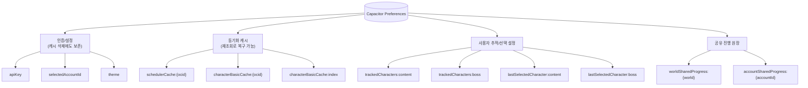
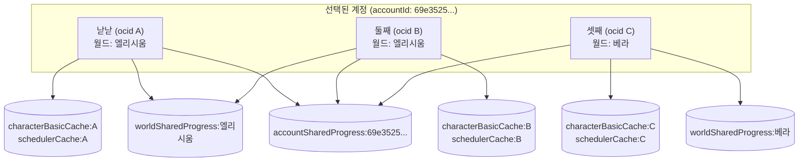

# Capacitor Preferences

`@capacitor/preferences` 기반 Key-Value 저장소. iOS는 UserDefaults, Android는 SharedPreferences에 매핑되며 **평문 저장**이다 — Keychain/Keystore 수준 암호화는 보장하지 않는다(강화된 보안 저장 도입은 별도 task로 미뤄둔 상태, `src/storage/api-key.ts` 주석 참고).

키 이름은 전부 `src/storage/keys.ts`에 모여 있고, 값 읽기/쓰기는 `src/storage/*.ts`의 개별 어댑터가 담당한다.

## 키 분류



## 전체 키 목록

| 키 | 값 형태 | 어댑터 | 캐시 삭제 시 | 비고 |
|---|---|---|---|---|
| `apiKey` | `string` (평문 API 키) | `storage/api-key.ts` | **보존** | Nexon Open API 개인 키. 연결 해제 시에만 삭제됨 |
| `selectedAccountId` | `string \| null` | `storage/api-key.ts` | **보존** | 여러 메이플 ID 중 선택된 계정. `null`이면 키 자체를 제거(값 없음) |
| `theme` | `ThemeName` (`'레테'\|'렌'\|'머쉬맘'\|'혼테일'`) | `storage/theme.ts` | **보존** | 유효하지 않은 값이면 `getTheme()`이 `null` 반환 |
| `schedulerCache:{ocid}` | `{ state: SchedulerCharacterState, syncedAt: string }` (JSON) | `storage/scheduler-cache.ts` | 삭제 | 캐릭터별 마지막 동기화 스냅샷(일간/주간/보스 콘텐츠) |
| `characterBasicCache:{ocid}` | `{ profile: CharacterBasicProfile, cachedAt: string }` (JSON) | `storage/character-basic-cache.ts` | 삭제 | 캐릭터 이미지·레벨·`access_flag` 캐시 |
| `characterBasicCache:index` | `string[]` (ocid 목록, JSON) | `storage/character-basic-cache.ts` | 삭제 | "지금까지 캐싱된 적 있는 캐릭터가 누구인지" 역인덱스([[ADR-017]] 결정 6). 동시 쓰기 유실 방지를 위해 read-modify-write를 프로미스 체인으로 직렬화 |
| `trackedCharacters:content` | `string[]` (ocid 목록, JSON) | `storage/character-selection.ts` | 삭제 | 컨텐츠 스케줄러 "캐릭터 관리"에서 추적 선택한 캐릭터 |
| `trackedCharacters:boss` | `string[]` (ocid 목록, JSON) | `storage/character-selection.ts` | 삭제 | 보스 스케줄러/보스 수익 화면이 공유하는 추적 목록 |
| `lastSelectedCharacter:content` | `string` (ocid, 평문) | `storage/character-selection.ts` | 삭제 | 컨텐츠 스케줄러 드롭다운의 마지막 선택 캐릭터 |
| `lastSelectedCharacter:boss` | `string` (ocid, 평문) | `storage/character-selection.ts` | 삭제 | 보스 스케줄러 드롭다운의 마지막 선택 캐릭터 |
| `worldSharedProgress:{world}` | `Record<itemName, SharedProgressEntry>` (JSON) | `storage/shared-progress-cache.ts` | 삭제 | 월드 단위로 완료가 공유되는 콘텐츠(예: 몬스터파크) 진행 원장([[ADR-030]]) |
| `accountSharedProgress:{accountId}` | `Record<itemName, SharedProgressEntry>` (JSON) | `storage/shared-progress-cache.ts` | 삭제 | 계정 단위로 공유되는 콘텐츠(예: 에픽 던전) 진행 원장([[ADR-030]]) |

> `trackedCharacters:daily` / `trackedCharacters:weekly`는 화면 개편([[ADR-013]]) 이전의 레거시 키다. `getTrackedCharacterOcids`가 호출될 때마다 `migrateLegacyTrackedCharacters()`가 먼저 실행되어, `trackedCharacters:content`가 아직 없으면 레거시 값을 1회 이관하고 원본을 지운다 — 이관이 끝난 기기에서는 다시 나타나지 않는 no-op이다.

## 캐릭터별(ocid)로 저장되는 데이터

`{ocid}`를 키에 물고 있는 항목은 정확히 두 개뿐이다 — `characterBasicCache:{ocid}`(가벼운 프로필)과 `schedulerCache:{ocid}`(그 캐릭터의 일간/주간/보스 진행 상태 전체). 둘 다 **캐릭터마다 독립된 Preferences 엔트리**라, 캐릭터가 10개면 이 두 종류가 최대 20개까지 쌓일 수 있다(추적 여부 무관 — 온보딩 예열이 계정의 전체 캐릭터를 캐싱하므로, [[ADR-016]]).

### 1. `characterBasicCache:{ocid}`

`CachedCharacterBasicEntry`(`storage/character-basic-cache.ts`) = `{ profile: CharacterBasicProfile, cachedAt }`.

| 필드 | 타입 | 설명 |
|---|---|---|
| `profile.name` | `string` | `character_name` 그대로 |
| `profile.level` | `number` | |
| `profile.imageUrl` | `string` | Nexon이 호스팅하는 캐릭터 룩 이미지의 전체 URL(`character_image`) |
| `profile.accessFlag` | `boolean` | `access_flag`. `false`면 "캐릭터 관리" 피커 후보 목록에서 제외 |
| `profile.world?` | `string` | `world_name`. **옵셔널** — 이 필드가 추가되기 전에 캐싱된 옛 엔트리에는 없을 수 있음 |
| `cachedAt` | `string` (ISO) | wire의 시각이 아니라 **이 기기가 캐싱한 실제 시각** |

```json
{
  "profile": {
    "name": "낟낟",
    "level": 293,
    "imageUrl": "https://open.api.nexon.com/static/maplestory/character/look/abcxyz?wmotion=W02",
    "accessFlag": true,
    "world": "엘리시움"
  },
  "cachedAt": "2026-07-12T00:05:00.000Z"
}
```

### 2. `schedulerCache:{ocid}` — 가장 크고 복잡한 값

`CachedSchedulerEntry`(`storage/scheduler-cache.ts`) = `{ state: SchedulerCharacterState, syncedAt }`. `state`는 `types/scheduler.ts`의 `SchedulerCharacterState`이고, Nexon 응답(`NexonSchedulerCharacterStateWire`)을 `nexon/schedule/normalize.ts`가 그대로 한글 도메인 표기로 변환해 저장한 것이다 — **API 원문(영문 flag 문자열 등)이 아니라 이미 정규화된 값**이 저장된다.

**최상위 필드**

| 필드 | 타입 | 설명 |
|---|---|---|
| `asOf` | `string` | wire의 `date` 그대로 보존(KST). **동기화가 실제로 일어난 시각이 아니라 API가 응답한 "기준일"** — 기기 캐싱 시각은 바깥의 `syncedAt`이 담당 |
| `characterName` / `world` / `level` / `jobClass` | `string` / `string` / `number` / `string` | 마지막 정상 응답 시점의 캐릭터 정보 스냅샷 |
| `dailyContents` | `DailyContent[]` | 아래 표 |
| `weeklyContents` | `WeeklyContent[]` | `DailyContent`와 완전히 같은 shape |
| `bossContents` | `BossContent[]` | 아래 표. **`bossDaily` 항목은 정규화 단계에서 아예 걸러져 이 배열에 없다**([[ADR-007]]) |
| `isDailyStale` / `isWeeklyStale` | `boolean` | 그 섹션의 wire 배열이 비어있었으면(=캐릭터가 이 리셋 주기 이후 미접속) `true` |
| `isWeeklyBossStale` / `isMonthlyBossStale` | `boolean` | `bossContents` wire에 해당 cycle 항목이 하나도 없었으면 `true` |

**`DailyContent` / `WeeklyContent`** (동일 shape, `nowCount`/`maxCount`는 `kind: 'contents'`일 때만 의미 있고 `questState`는 `kind: 'quest'`일 때만 값이 들어감)

| 필드 | 타입 | 설명 |
|---|---|---|
| `name` | `string` | `content_name` 그대로(정규화 없음 — 화면 표시 시점에 lib가 매칭) |
| `kind` | `'contents' \| 'quest'` | 진행형(카운트) 콘텐츠인지 완료형(상태) 퀘스트인지 |
| `isRegistered` | `boolean` | `registration_flag === 'true'` |
| `nowCount` / `maxCount` | `number` | 예: 몬스터파크 `7/14` |
| `questState` | `0 \| 1 \| 2 \| null` | `0`=시작 안함, `1`=진행 중, `2`=완료. `contents` kind는 보통 `null` |

**`BossContent`**

| 필드 | 타입 | 설명 |
|---|---|---|
| `name` | `string` | `content_name`(예: `"검은 마법사"`, `"시즌 보스 메이린"`) |
| `difficulty` | `'이지'\|'노멀'\|'하드'\|'카오스'\|'익스트림'` | wire의 영문(`easy`~`extreme`)을 **저장 시점에 이미 한글로 변환** |
| `cycle` | `'weekly' \| 'monthly'` | wire의 `bossWeekly`/`bossMonthly`를 단순화 |
| `isRegistered` | `boolean` | |
| `isComplete` | `boolean` | 카드 뱃지 표시용 — 등록된 항목은 같은 보스명의 **다른 난이도**가 완료면 승격됨([[ADR-031]]) |
| `ownComplete` | `boolean` | 이 난이도 **자신의** 원본 `complete_flag`, 승격 없음([[ADR-032]]). 보스 수익 계산기는 실제 처치 난이도 판정에 이 필드만 씀 |

> **`isComplete` vs `ownComplete` 실제 사례([[ADR-033]] 재현 버그)**: 루시드를 게임 내에서 **이지**로 등록해두고 실제로는 **노멀**을 처치하면, 저장되는 `bossContents`엔 두 항목이 함께 들어간다.
> ```json
> [
>   { "name": "루시드", "difficulty": "이지", "cycle": "weekly", "isRegistered": true,  "isComplete": true, "ownComplete": false },
>   { "name": "루시드", "difficulty": "노멀", "cycle": "weekly", "isRegistered": false, "isComplete": true, "ownComplete": true }
> ]
> ```
> 등록된 "이지" 항목은 자기 자신은 못 잡았지만(`ownComplete: false`) 같은 이름의 "노멀"이 완료라 뱃지용 `isComplete`만 승격됨 — 보스 수익 계산기가 `isComplete`를 그대로 썼다면 "이지 가격"으로 잘못 계산했을 버그가 실제로 있었고, `ownComplete`(진짜 처치 난이도)를 별도로 저장해두는 것으로 고쳤다.

**전체 예시** (실제 테스트 픽스처 기반, `nexon/schedule/__tests__/normalize.test.ts`)

```json
{
  "state": {
    "asOf": "2026-07-09T00:00+09:00",
    "characterName": "낟낟",
    "world": "엘리시움",
    "level": 293,
    "jobClass": "렌",
    "dailyContents": [
      { "name": "몬스터파크", "kind": "contents", "isRegistered": true, "nowCount": 7, "maxCount": 14, "questState": null },
      { "name": "[일일 퀘스트] 레헬른의 평온한 밤", "kind": "quest", "isRegistered": true, "nowCount": 0, "maxCount": 0, "questState": 1 }
    ],
    "weeklyContents": [
      { "name": "에픽 던전 : 악몽선경", "kind": "contents", "isRegistered": true, "nowCount": 5, "maxCount": 0, "questState": null },
      { "name": "[메이플 유니온] 주간 드래곤 퇴치", "kind": "quest", "isRegistered": false, "nowCount": 0, "maxCount": 0, "questState": 0 }
    ],
    "bossContents": [
      { "name": "검은 마법사", "difficulty": "익스트림", "cycle": "monthly", "isRegistered": true, "isComplete": true, "ownComplete": true },
      { "name": "스우", "difficulty": "하드", "cycle": "weekly", "isRegistered": true, "isComplete": false, "ownComplete": false }
    ],
    "isDailyStale": false,
    "isWeeklyStale": false,
    "isWeeklyBossStale": false,
    "isMonthlyBossStale": false
  },
  "syncedAt": "2026-07-23T10:00:00.000Z"
}
```
(wire에 함께 있던 `힐라 하드(bossDaily)`는 이 앱이 다루지 않는 대상이라 정규화 단계에서 배열에서 완전히 제외됐다 — 완료 승격 판정에도 관여하지 않는다, [[ADR-032]]/[[ADR-033]])

> **캐치 — 배열 항목이 전부 "오늘" 응답인 건 아니다**: 캐릭터가 이번 리셋 주기 이후 미접속이면 해당 섹션이 비거나 개별 항목이 누락된 채로 온다. 이럴 때 `schedule-sync`가 로컬 캐시나(있으면, [[ADR-030]]) 어제~그제 응답을 추가 조회해([[ADR-034]]) 진행값만 리셋한 채로 항목을 채워 넣는다. 즉 최상위 `asOf`는 "오늘" 날짜여도, 그 안 배열의 개별 항목은 실제로는 며칠 전 응답에서 복원된 것일 수 있다 — 이 구분은 저장된 JSON만 봐서는 알 수 없고 동기화 로직을 신뢰해야 한다.

### `SharedProgressEntry` (공유 진행 원장 항목)
캐릭터가 아니라 **월드/계정** 단위로 키가 잡히는 별도 원장이다(`worldSharedProgress:{world}` / `accountSharedProgress:{accountId}`) — 값 shape은 `DailyContent`/`WeeklyContent`와 비슷하지만 별개 타입이다.
```json
{
  "몬스터파크": {
    "active": true,
    "kind": "contents",
    "nowCount": 7,
    "maxCount": 14,
    "questState": null,
    "lastUpdatedBucket": "2026-07-23"
  }
}
```
`lastUpdatedBucket`은 리셋 경계 판단용 키다(일간은 `lib/reset-clock`의 KST 날짜, 주간은 `lib/boss-profit-period`의 `periodKey`). 이 값이 현재 리셋 구간보다 오래됐으면 화면 표시 시 진행값만 리셋하고 `active`는 유지한다.

## 캐릭터가 여러 명일 때

선택된 계정(`selectedAccountId`) 하나에 캐릭터가 여러 개 딸려 있는 게 일반적인 경우다(`character/list` 응답의 `account_list[].character_list`). 캐릭터 수가 늘어난다고 모든 키가 똑같이 N배로 늘어나는 건 아니다 — **키마다 "무엇 단위로 쪼개지는지"가 다르다.**



- **캐릭터당 1:1 (계속 늘어남)** — `characterBasicCache:{ocid}`, `schedulerCache:{ocid}`. 캐릭터가 3명이면 이 두 종류가 각각 3개씩, 총 6개 키가 생긴다.
- **월드당 1개 (같은 월드 캐릭터끼리 공유)** — `worldSharedProgress:{world}`. 낟낟·둘째가 둘 다 "엘리시움"이면 **같은 키를 공유**한다. 몬스터파크처럼 게임 자체가 월드 단위로 진행을 공유하는 콘텐츠라, 이건 버그가 아니라 실제 게임 규칙을 그대로 반영한 것이다([[ADR-030]]).
- **계정당 1개 (선택된 계정의 전체 캐릭터가 공유)** — `accountSharedProgress:{accountId}`. `selectedAccountId`는 항상 하나만 활성 상태이므로, 실질적으로 이 키는 **한 번에 정확히 1개**만 존재한다 — 낟낟·둘째·셋째 전원이 같은 키에 쓴다(에픽 던전처럼 계정 전체가 공유하는 콘텐츠용).

### 캐릭터별로 언제 쓰기가 일어나는가 — 추적 여부에 따른 차이

| 시점 | 대상 캐릭터 | 쓰는 것 |
|---|---|---|
| 온보딩 완료 직전 예열([[ADR-016]], `features/onboarding/prefetch.ts`) | **계정의 전체 캐릭터** (추적 여부 무관) | `characterBasicCache:{ocid}` 전원. `schedulerCache:{ocid}`는 `accessFlag: true`인 캐릭터만. **`worldSharedProgress`/`accountSharedProgress`는 이 시점엔 쓰지 않는다** — 아래 참고 |
| 컨텐츠 스케줄러 새로고침 | `trackedCharacters:content`에 속한 캐릭터만 | 해당 캐릭터들의 `schedulerCache:{ocid}` + 그 캐릭터들의 월드/계정 원장 |
| 보스 스케줄러/보스 수익 새로고침 | `trackedCharacters:boss`에 속한 캐릭터만 | 동일 |

`trackedCharacters:content`와 `trackedCharacters:boss`는 **화면마다 완전히 독립적으로 선택**한다(같은 캐릭터를 컨텐츠에서는 추적하고 보스에서는 추적 안 할 수 있음). 그런데 `schedulerCache:{ocid}`는 화면 구분 없이 **캐릭터 하나당 daily/weekly/boss 전체를 한 덩어리로** 저장하므로, 컨텐츠 스케줄러만 추적 중인 캐릭터라도 컨텐츠 화면이 새로고침될 때마다 그 캐릭터의 `bossContents`까지 같이 갱신된다 — 보스 화면이 그 캐릭터를 추적하지 않아 직접 동기화를 트리거하지 않아도, 컨텐츠 쪽 동기화의 부수 효과로 캐시가 최신 상태를 유지하는 셈이다(단, 화면에 노출할지는 각 화면의 추적 목록이 별도로 결정).

같은 이유로 **`worldSharedProgress`/`accountSharedProgress`는 "추적되어 실제로 동기화된" 캐릭터를 통해서만 갱신된다** — 온보딩 예열은 이 두 원장을 건드리지 않는다. 그래서 캐릭터를 추적 목록에 한 번도 넣지 않으면, 그 캐릭터의 개인 스냅샷(`schedulerCache`)은 예열로 채워져 있어도 걔 몫의 월드/계정 공유 항목은 다른 캐릭터가 대신 갱신해주지 않는 한 계속 비어 있을 수 있다.

### 엣지 케이스 — 계정을 바꾸면 이전 계정 데이터는 고아가 된다

설정에서 "계정(메이플 ID) 변경"을 하면 `selectedAccountId`만 새 값으로 덮어써진다(`docs/ARCHITECTURE.md` "설정 화면" 절). 이전 계정 소속이던 캐릭터들의 `characterBasicCache:{ocid}`·`schedulerCache:{ocid}`, 이전 계정이 남긴 `trackedCharacters:*`의 옛 ocid들, `accountSharedProgress:{이전accountId}`는 **자동으로 정리되지 않고 그대로 남는다** — 참조 무결성을 지키지 않고 지우는 대신, 명시적인 "캐시 데이터 삭제"([lifecycle.md](./lifecycle.md) 참고)로만 정리되는 쪽을 택한 설계다. 다시 이전 계정으로 돌아가면 이 고아 데이터가 그대로 유효한 캐시로 재사용된다는 것이 장점이다.
