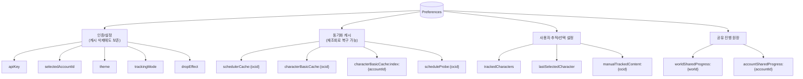
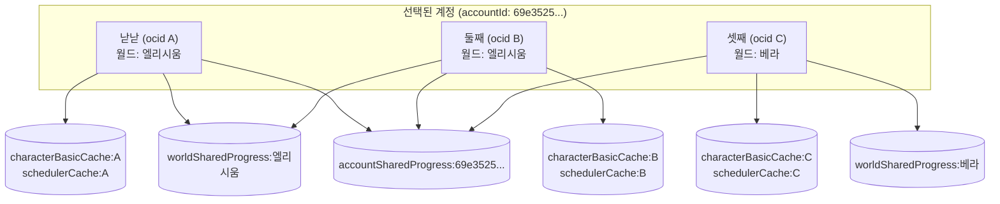

# Preferences (Key-Value 저장소)

iOS UserDefaults / Android SharedPreferences 를 그대로 쓰는 Key-Value 저장소이고 **평문 저장**이다 — Keychain/Keystore 수준 암호화는 보장하지 않는다(강화된 보안 저장 도입은 별도 task로 미뤄둔 상태, `src/storage/api-key.ts` 주석 참고).

> **읽고 쓰는 경로**: `storage/adapters/rn-preferences.ts` → 로컬 Expo 모듈 `modules/capacitor-storage`.
> 캐패시터 시절 `@capacitor/preferences` 가 쓰던 **바로 그 키와 그 저장소**를 연다 — 기존 사용자의
> 데이터를 한 바이트도 옮기지 않기 위해서다([migration/data.md](../migration/data.md) 결정 1). 그래서
> 키 앞에 붙는 네이티브 접두사 규칙까지 그대로이고, 그 변환은 `storage/adapters/capacitor-storage-keys.ts`
> 가 맡는다.

키 이름은 전부 `src/storage/keys.ts`에 모여 있고, 값 읽기/쓰기는 `src/storage/*.ts`의 개별 어댑터가 담당한다.

## 키 분류


```mermaid
flowchart TD
    Pref[("Preferences")]
    Pref --> Auth["인증/설정\n(캐시 삭제에도 보존)"]
    Pref --> Sync["동기화 캐시\n(재조회로 복구 가능)"]
    Pref --> Track["사용자 추적/선택 설정"]
    Pref --> Ledger["공유 진행 원장"]

    Auth --> apiKey
    Auth --> selectedAccountId
    Auth --> theme
    Auth --> trackingMode
    Auth --> dropEffect

    Sync --> schedulerCache["schedulerCache:{ocid}"]
    Sync --> charBasic["characterBasicCache:{ocid}"]
    Sync --> charBasicIdx["characterBasicCache:index:{accountId}"]
    Sync --> probe["scheduleProbe:{ocid}"]

    Track --> tracked["trackedCharacters"]
    Track --> last["lastSelectedCharacter"]
    Track --> manual["manualTrackedContent:{ocid}"]

    Ledger --> world["worldSharedProgress:{world}"]
    Ledger --> account["accountSharedProgress:{accountId}"]
```

## 전체 키 목록

| 키 | 값 형태 | 어댑터 | 캐시 삭제 시 | 비고 |
|---|---|---|---|---|
| `apiKey` | `string` (평문 API 키) | `storage/api-key.ts` | **보존** | Nexon Open API 개인 키. 연결 해제 시에만 삭제됨 |
| `selectedAccountId` | `string \| null` | `storage/api-key.ts` | **보존** | 여러 메이플 ID 중 선택된 계정. `null`이면 키 자체를 제거(값 없음). ⛔ **지금은 읽지도 쓰지도 않는다**([[ADR-143]] 결정 7 — 계정을 고르지 않는다). 기존 사용자 기기에 값이 남아 있을 뿐이라 **정리 대상**이다 |
| `theme` | `ThemeName` (`'레테'\|'렌'\|'머쉬맘'\|'혼테일'`) | `storage/theme.ts` | **보존** | 유효하지 않은 값이면 `getTheme()`이 `null` 반환 |
| `trackingMode` | `'auto' \| 'manual'` | `storage/tracking-mode.ts` | **보존** | 값이 없거나 알 수 없는 값이면 어댑터가 **`null`(미선택)** 을 반환하고 소비처가 `?? 'auto'` 로 흡수한다([[ADR-086]] 결정 2 — 동작 기본값은 그대로 자동, [[ADR-035]] 결정 2 유지). 온보딩 게이트만 이 `null` 을 "아직 안 골랐다"로 읽는다. 보존 결정은 [[ADR-052]] |
| `dropEffect` | `'on' \| 'off'` | `storage/drop-effect.ts` | **보존** | 고가 드롭 연출 표시 여부([[ADR-040]] 결정 6). 값이 없으면 표시(on). 보존 결정은 [[ADR-052]] |
| `schedulerCache:{ocid}` | `{ state: SchedulerCharacterState, syncedAt: string }` (JSON) | `storage/scheduler-cache.ts` | 삭제 | 캐릭터별 마지막 동기화 스냅샷(일간/주간/보스 콘텐츠) |
| `characterBasicCache:{ocid}` | `{ profile: CharacterBasicProfile, cachedAt: string }` (JSON) | `storage/character-basic-cache.ts` | 삭제 | 캐릭터 이미지·레벨·`access_flag` 캐시. **`jobClass` 가 옵셔널로 붙는다**([[ADR-144]] 결정 2, 화면은 RN 앱만 · **채우는 경로까지 구현** — 화면은 아직) — 캐릭터 카드 2줄이 «레벨 + 직업» 이고 위 층은 네트워크 없이 그리기 때문이다. **값의 출처는 `character/basic` 이 아니라 `character/list`** 이고 쓰는 쪽이 함께 넘긴다(그 응답이 직업을 준다고 단정하지 않는다). 옛 엔트리에는 없어 `undefined` 이고, 그때 화면은 레벨만 그린다 |
| `characterBasicCache:index:{accountId}` | `string[]` (ocid 목록, JSON) | `storage/character-basic-cache.ts` | 삭제 | "이 **계정**에서 지금까지 캐싱된 적 있는 캐릭터가 누구인지" 역인덱스([[ADR-017]] 결정 6 + [[ADR-086]] 결정 9). 동시 쓰기 유실 방지를 위해 read-modify-write를 프로미스 체인으로 직렬화. 계정별로 나뉘기 전(`characterBasicCache:index`)에는 피커 stub 단계가 **이전 계정 캐릭터까지 그렸다** — 마이그레이션은 전역 인덱스를 현재 `selectedAccountId` 것으로 이관(예열이 채운 계정은 그것 하나뿐이라 정확)하고 전역 키를 지운다 |
| `scheduleProbe:{ocid}` | `{ unavailable?: true, dates: Record<'YYYY-MM-DD', ProbeRecord> }` (JSON) | `storage/schedule-probe-ledger.ts` | 삭제 | **(ocid, 날짜) 조회 원장**([[ADR-086]] 결정 4 = [[ADR-067]] 결정 5). "이 캐릭터를 이 날짜로 이미 조회했고 결과가 이랬다"를 기록해 ① 후보 자격 스윕과 ② 선채움([[ADR-034]])이 같은 날짜를 다시 부르지 않게 한다. 성공·`OPENAPI00003`·`OPENAPI00004` 만 기록하고 `OPENAPI00009`·네트워크 실패는 **기록하지 않는다**(나중에 풀린다). 읽을 때 14일 윈도우 밖 날짜를 prune. 재조회로 복구되는 파생 데이터라 `KEEP_KEYS` 에 넣지 않는다. **소비자가 셋이 됐다** — ③ 처치 날짜 캐기([[ADR-172]])가 `observed` 기록의 `bosses`(그날 `ownComplete` 였던 «보스|난이도» 목록)를 읽고 쓴다. 그 필드가 **없는**(`undefined`) 옛 기록은 «보스 정보를 안 남긴 관측» 이라 미조회로 취급해 다시 부른다 — 빈 배열(«그날 완료 0건»)과 섞으면 관측을 잃는다 |
| `trackedCharacters` | `string[]` (ocid 목록, JSON) | `storage/character-selection.ts` | 삭제 | "캐릭터 관리"에서 추적 선택한 캐릭터. **앱 전역 단일 목록**([[ADR-042]]) — 컨텐츠/보스 화면이 같은 목록을 본다. `null`(미설정)과 `[]`(전부 해제)의 의미가 다름([[ADR-012]]). **RN 앱에서는 계정 경계를 넘고(여러 메이플 ID 의 ocid 가 섞인다) 배열 순서가 곧 표시 순서다**([[ADR-143]] 결정 2·3) — 값 형태는 그대로라 마이그레이션이 없다 |
| `representativeCharacter` | `string` (ocid, 평문) | `storage/character-selection.ts` | 삭제 | **대표 캐릭터**([[ADR-143]] 결정 4, RN 앱만 · **어댑터 구현 완료** — 쓰는 화면은 아직). 표식일 뿐 지금은 읽는 화면이 없다. 미지정이면 키가 **없고**(첫 번째가 임시 대표 — 그 파생값은 저장하지 않는다), 저장 시점에 대표가 목록에 없으면 지운다 — 그 판정은 `setTrackedCharacterOcids` 안에 있어 목록을 어느 경로로 저장하든 매달린 대표가 남지 않고, 목록과 대표를 함께 확정하는 자리는 `setCharacterSelection(ocids, representative)` 하나다 |
| `lastSelectedCharacter` | `string` (ocid, 평문) | `storage/character-selection.ts` | 삭제 | 드롭다운의 마지막 선택 캐릭터. 이것도 화면 구분 없는 단일 키([[ADR-042]]). `representativeCharacter` 와 **다른 축**이다 — 이쪽은 앱이 쓰고 저쪽은 사용자가 말한 값이다 |
| `manualTrackedContent:{ocid}` | `ManualTrackedItem[]` (JSON) | `storage/manual-tracked-content.ts` | 삭제 | 수동 모드에서 그 캐릭터가 추적할 항목의 **멤버십 + 사용자 입력 `maxCount`만**([[ADR-035]] 결정 6). 진행값·체크 상태는 여기 없고 `schedulerCache`가 단일 진실 공급원 |
| `worldSharedProgress:{world}` | `Record<itemName, SharedProgressEntry>` (JSON) | `storage/shared-progress-cache.ts` | 삭제 | 월드 단위로 완료가 공유되는 콘텐츠(예: 몬스터파크) 진행 원장([[ADR-030]]) |
| `accountSharedProgress:{accountId}` | `Record<itemName, SharedProgressEntry>` (JSON) | `storage/shared-progress-cache.ts` | 삭제 | 계정 단위로 공유되는 콘텐츠(예: 에픽 던전) 진행 원장([[ADR-030]]). **`{accountId}` 는 «지금 고른 계정» 이 아니라 «그 캐릭터가 사는 계정» 이다**([[ADR-143]] 결정 6) — 추적 목록이 계정을 넘으면 이 키가 **동시에 여러 개** 살아 있고, 캐릭터마다 자기 것을 읽고 쓴다. 한 계정 것으로 몰면 계정 공유 완료가 계정을 넘어 번진다 |

### 알림 (**설계 완료, 구현 전** — [[ADR-146]])

| 키 | 값 형태 | 어댑터 | 캐시 삭제 시 | 비고 |
|---|---|---|---|---|
| `notificationSettings` | `Record<NotificationKind, { enabled: boolean, timeKst: string \| null }>` (JSON) | `storage/notification-settings.ts` | **보존**(`KEEP_KEYS`) | 사용자가 켠 알림과 고른 시각. **재조회로 복구되지 않는 사용자가 만든 값**이라 위 «새 키» 규칙에 따라 보존 쪽이다([[ADR-052]] 결정 1 과 같은 기준). 값이 없는 `kind` 는 레지스트리의 `defaultEnabled`·`defaultTimeKst` 로 읽는다 — **기본값을 저장하지 않으므로** OTA 가 기본값을 바꾸면 손대지 않은 사용자에게 그대로 반영된다 |
| `notificationLedger` | `{ id: number, kind: string, fireAt: string }[]` (JSON) | `storage/notification-ledger.ts` | 삭제 | **우리가 지금 예약해 둔 것의 원장**([[ADR-146]] 결정 5). OS 는 예약을 들고 있는데 앱은 개수만 조회할 수 있어([lifecycle.md](./lifecycle.md)) 우리가 기억한다. 재조정이 **계획과의 차집합**으로만 움직이고, **원장에 있는데 레지스트리에 없는 `kind` 는 무조건 취소**한다 — OTA 가 알림 종류를 지웠을 때 예약이 유령으로 남는 것을 막는 유일한 장치다 |

**원장이 지워져도 안전한 이유** — 계획이 다시 예약할 때 **결정적 id 라 같은 예약을 덮어쓴다.** 남는 위험은 «지금 레지스트리에 없는 옛 `kind` 의 예약» 뿐인데 그것은 원장 없이는 애초에 못 지운다. 그래서 `KEEP_KEYS` 에 넣지 않는다(`lastRunBundleVersion` 과 같은 판단 — 지워져도 생기는 것은 거짓이 아니라 «한 번 더 함» 이다).

> **새 키를 추가할 때 — 기본값은 "지워진다"다.** 캐시 삭제는 Preferences를 반전 규칙(`storage/cache-data.ts`의 `KEEP_KEYS` 제외 전부)으로 지우므로, 아무 조치도 하지 않으면 **새 키는 자동으로 삭제 대상**이 된다. 재조회로 복구할 수 없는 값 — 특히 인앱 결제/구매(IAP) 상태처럼 지워지면 사용자가 실제 손해를 보는 키 — 은 만들 때 반드시 `KEEP_KEYS`에 함께 넣어라([[ADR-052]] 결정 1이 `trackingMode`·`dropEffect`에 적용한 것과 같은 기준: "재조회로 복구되는 캐시인가, 사용자가 명시적으로 만든 값인가").

> **레거시 키 4종** — `trackedCharacters:content` / `:boss`([[ADR-013]] 시대) 와 `trackedCharacters:daily` / `:weekly`([[ADR-013]] 이전) 는 전부 [[ADR-042]] 통합 이후의 레거시다(`lastSelectedCharacter:content` / `:boss` 도 마찬가지). `getTrackedCharacterOcids`가 호출될 때마다 `character-selection.ts`의 통합 마이그레이션이 먼저 실행되어, `trackedCharacters`가 아직 없으면 **네 레거시 목록의 중복 제거된 합집합**을 1회 이관하고 원본을 지운다 — 이관이 끝난 기기에서는 다시 나타나지 않는 no-op이다. daily/weekly까지 흡수하는 이유는 통합 후 `:content` 키를 더 쓰지 않아 옛 이관 체인이 끊기기 때문이다.

## 캐릭터별(ocid)로 저장되는 데이터

`{ocid}`를 키에 물고 있는 항목은 정확히 두 개뿐이다 — `characterBasicCache:{ocid}`(가벼운 프로필)과 `schedulerCache:{ocid}`(그 캐릭터의 일간/주간/보스 진행 상태 전체). 둘 다 **캐릭터마다 독립된 Preferences 엔트리**라, 캐릭터가 10개면 이 두 종류가 최대 20개까지 쌓일 수 있다(추적 여부 무관 — 온보딩 예열이 계정의 전체 캐릭터를 캐싱하므로, ADR-016).

### 1. `characterBasicCache:{ocid}`

`CachedCharacterBasicEntry`(`storage/character-basic-cache.ts`) = `{ profile: CharacterBasicProfile, cachedAt }`.

| 필드 | 타입 | 설명 |
|---|---|---|
| `profile.name` | `string` | `character_name` 그대로 |
| `profile.level` | `number` | |
| `profile.imageUrl` | `string` | Nexon이 호스팅하는 캐릭터 룩 이미지의 전체 URL(`character_image`) |
| `profile.accessFlag` | `boolean` | `access_flag`(최근 접속 여부). **후보 목록의 배제 게이트가 아니다**([[ADR-086]] 결정 3) — `true` 면 후보 자격 즉시 통과(충분조건), `false` 는 "최근 접속 없음"일 뿐이라 최근 14일 활동 기록으로 한 번 더 본다 |
| `profile.world?` | `string` | `world_name`. **옵셔널** — 이 필드가 추가되기 전에 캐싱된 옛 엔트리에는 없을 수 있음 |
| `profile.jobClass?` | `string` | 캐릭터 카드 2줄의 «레벨 + 직업»([[ADR-144]] 결정 2). **옵셔널**이고 값의 출처는 `character/basic` 이 아니라 **`character/list`** 다 — `normalizeCharacterBasic` 이 채우지 않고 캐시에 쓰는 쪽이 엔트리에 담아 넘긴다([[ADR-006]] 의 태도: basic 응답이 직업을 준다는 것을 실측한 적이 없다). 없으면 화면이 레벨만 그린다. 넘기는 자리는 `fetchCharacterBasicCached` 의 **선택 인자 하나**이고(2026-08-17 구현), 값을 안 넘긴 호출은 **캐시에 이미 있던 값을 유지한다** — 아는 값을 `undefined` 로 덮으면 화면에서 직업이 사라진다 |
| `cachedAt` | `string` (ISO) | wire의 시각이 아니라 **이 기기가 캐싱한 실제 시각** |

```json
{
  "profile": {
    "name": "낟낟",
    "level": 293,
    "imageUrl": "https://open.api.nexon.com/static/maplestory/character/look/abcxyz?wmotion=W02",
    "accessFlag": true,
    "world": "엘리시움"
  },
  "cachedAt": "2026-07-12T00:05:00.000Z"
}
```

### 2. `schedulerCache:{ocid}` — 가장 크고 복잡한 값

`CachedSchedulerEntry`(`storage/scheduler-cache.ts`) = `{ state: SchedulerCharacterState, syncedAt }`. `state`는 `types/scheduler.ts`의 `SchedulerCharacterState`이고, Nexon 응답(`NexonSchedulerCharacterStateWire`)을 `nexon/schedule/normalize.ts`가 그대로 한글 도메인 표기로 변환해 저장한 것이다 — **API 원문(영문 flag 문자열 등)이 아니라 이미 정규화된 값**이 저장된다.

**최상위 필드**

| 필드 | 타입 | 설명 |
|---|---|---|
| `asOf` | `string` | wire의 `date` 그대로 보존(KST). **동기화가 실제로 일어난 시각이 아니라 API가 응답한 "기준일"** — 기기 캐싱 시각은 바깥의 `syncedAt`이 담당 |
| `characterName` / `world` / `level` / `jobClass` | `string` / `string` / `number` / `string` | 마지막 정상 응답 시점의 캐릭터 정보 스냅샷 |
| `dailyContents` | `DailyContent[]` | 아래 표 |
| `weeklyContents` | `WeeklyContent[]` | `DailyContent`와 완전히 같은 shape |
| `bossContents` | `BossContent[]` | 아래 표. **`bossDaily` 항목은 정규화 단계에서 아예 걸러져 이 배열에 없다**([[ADR-007]]) |
| `isDailyStale` / `isWeeklyStale` | `boolean` | 그 섹션의 wire 배열이 비어있었으면(=캐릭터가 이 리셋 주기 이후 미접속) `true` |
| `isWeeklyBossStale` / `isMonthlyBossStale` | `boolean` | `bossContents` wire에 해당 cycle 항목이 하나도 없었으면 `true` |

**`DailyContent` / `WeeklyContent`** (동일 shape, `nowCount`/`maxCount`는 `kind: 'contents'`일 때만 의미 있고 `questState`는 `kind: 'quest'`일 때만 값이 들어감)

| 필드 | 타입 | 설명 |
|---|---|---|
| `name` | `string` | `content_name` 그대로(정규화 없음 — 화면 표시 시점에 lib가 매칭) |
| `kind` | `'contents' \| 'quest'` | 진행형(카운트) 콘텐츠인지 완료형(상태) 퀘스트인지 |
| `isRegistered` | `boolean` | `registration_flag === 'true'` |
| `nowCount` / `maxCount` | `number` | 예: 몬스터파크 `7/14` |
| `questState` | `0 \| 1 \| 2 \| null` | `0`=시작 안함, `1`=진행 중, `2`=완료. `contents` kind는 보통 `null` |

**`BossContent`**

| 필드 | 타입 | 설명 |
|---|---|---|
| `name` | `string` | `content_name`(예: `"검은 마법사"`, `"시즌 보스 메이린"`) |
| `difficulty` | `'이지'\|'노멀'\|'하드'\|'카오스'\|'익스트림'` | wire의 영문(`easy`~`extreme`)을 **저장 시점에 이미 한글로 변환** |
| `cycle` | `'weekly' \| 'monthly'` | wire의 `bossWeekly`/`bossMonthly`를 단순화 |
| `isRegistered` | `boolean` | |
| `isComplete` | `boolean` | 카드 뱃지 표시용 — 등록된 항목은 같은 보스명의 **다른 난이도**가 완료면 승격됨([[ADR-031]]) |
| `ownComplete` | `boolean` | 이 난이도 **자신의** 원본 `complete_flag`, 승격 없음([[ADR-032]]). 보스 수익 계산기는 실제 처치 난이도 판정에 이 필드만 씀 |

> **`isComplete` vs `ownComplete` 실제 사례([[ADR-033]] 재현 버그)**: 루시드를 게임 내에서 **이지**로 등록해두고 실제로는 **노멀**을 처치하면, 저장되는 `bossContents`엔 두 항목이 함께 들어간다.
> ```json
> [
>   { "name": "루시드", "difficulty": "이지", "cycle": "weekly", "isRegistered": true,  "isComplete": true, "ownComplete": false },
>   { "name": "루시드", "difficulty": "노멀", "cycle": "weekly", "isRegistered": false, "isComplete": true, "ownComplete": true }
> ]
> ```
> 등록된 "이지" 항목은 자기 자신은 못 잡았지만(`ownComplete: false`) 같은 이름의 "노멀"이 완료라 뱃지용 `isComplete`만 승격됨 — 보스 수익 계산기가 `isComplete`를 그대로 썼다면 "이지 가격"으로 잘못 계산했을 버그가 실제로 있었고, `ownComplete`(진짜 처치 난이도)를 별도로 저장해두는 것으로 고쳤다.

**전체 예시** (실제 테스트 픽스처 기반, `nexon/schedule/__tests__/normalize.test.ts`)

```json
{
  "state": {
    "asOf": "2026-07-09T00:00+09:00",
    "characterName": "낟낟",
    "world": "엘리시움",
    "level": 293,
    "jobClass": "렌",
    "dailyContents": [
      { "name": "몬스터파크", "kind": "contents", "isRegistered": true, "nowCount": 7, "maxCount": 14, "questState": null },
      { "name": "[일일 퀘스트] 레헬른의 평온한 밤", "kind": "quest", "isRegistered": true, "nowCount": 0, "maxCount": 0, "questState": 1 }
    ],
    "weeklyContents": [
      { "name": "에픽 던전 : 악몽선경", "kind": "contents", "isRegistered": true, "nowCount": 5, "maxCount": 0, "questState": null },
      { "name": "[메이플 유니온] 주간 드래곤 퇴치", "kind": "quest", "isRegistered": false, "nowCount": 0, "maxCount": 0, "questState": 0 }
    ],
    "bossContents": [
      { "name": "검은 마법사", "difficulty": "익스트림", "cycle": "monthly", "isRegistered": true, "isComplete": true, "ownComplete": true },
      { "name": "스우", "difficulty": "하드", "cycle": "weekly", "isRegistered": true, "isComplete": false, "ownComplete": false }
    ],
    "isDailyStale": false,
    "isWeeklyStale": false,
    "isWeeklyBossStale": false,
    "isMonthlyBossStale": false
  },
  "syncedAt": "2026-07-23T10:00:00.000Z"
}
```
(wire에 함께 있던 `힐라 하드(bossDaily)`는 이 앱이 다루지 않는 대상이라 정규화 단계에서 배열에서 완전히 제외됐다 — 완료 승격 판정에도 관여하지 않는다, [[ADR-032]]/[[ADR-033]])

> **캐치 — 배열 항목이 전부 "오늘" 응답인 건 아니다**: 캐릭터가 이번 리셋 주기 이후 미접속이면 해당 섹션이 비거나 개별 항목이 누락된 채로 온다. 이럴 때 `schedule-sync`가 로컬 캐시나(있으면, [[ADR-030]]) 어제~그제 응답을 추가 조회해([[ADR-034]]) 진행값만 리셋한 채로 항목을 채워 넣는다. 즉 최상위 `asOf`는 "오늘" 날짜여도, 그 안 배열의 개별 항목은 실제로는 며칠 전 응답에서 복원된 것일 수 있다 — 이 구분은 저장된 JSON만 봐서는 알 수 없고 동기화 로직을 신뢰해야 한다.

### `SharedProgressEntry` (공유 진행 원장 항목)
캐릭터가 아니라 **월드/계정** 단위로 키가 잡히는 별도 원장이다(`worldSharedProgress:{world}` / `accountSharedProgress:{accountId}`) — 값 shape은 `DailyContent`/`WeeklyContent`와 비슷하지만 별개 타입이다.
```json
{
  "몬스터파크": {
    "active": true,
    "kind": "contents",
    "nowCount": 7,
    "maxCount": 14,
    "questState": null,
    "lastUpdatedBucket": "2026-07-23"
  }
}
```
`lastUpdatedBucket`은 리셋 경계 판단용 키다(일간은 `lib/scheduler/reset-clock`의 KST 날짜, 주간은 `lib/boss/boss-profit-period`의 `periodKey`). 이 값이 현재 리셋 구간보다 오래됐으면 화면 표시 시 진행값만 리셋하고 `active`는 유지한다.

## 캐릭터가 여러 명일 때

선택된 계정(`selectedAccountId`) 하나에 캐릭터가 여러 개 딸려 있는 게 일반적인 경우다(`character/list` 응답의 `account_list[].character_list`). 캐릭터 수가 늘어난다고 모든 키가 똑같이 N배로 늘어나는 건 아니다 — **키마다 "무엇 단위로 쪼개지는지"가 다르다.**


```mermaid
flowchart TB
    subgraph Account["선택된 계정 (accountId: 69e3525...)"]
        A["낟낟 (ocid A)\n월드: 엘리시움"]
        B["둘째 (ocid B)\n월드: 엘리시움"]
        C["셋째 (ocid C)\n월드: 베라"]
    end

    A --> CA[("characterBasicCache:A\nschedulerCache:A")]
    B --> CB[("characterBasicCache:B\nschedulerCache:B")]
    C --> CC[("characterBasicCache:C\nschedulerCache:C")]

    A --> WE[("worldSharedProgress:엘리시움")]
    B --> WE
    C --> WB[("worldSharedProgress:베라")]

    A --> AC[("accountSharedProgress:69e3525...")]
    B --> AC
    C --> AC
```

- **캐릭터당 1:1 (계속 늘어남)** — `characterBasicCache:{ocid}`, `schedulerCache:{ocid}`. 캐릭터가 3명이면 이 두 종류가 각각 3개씩, 총 6개 키가 생긴다.
- **월드당 1개 (같은 월드 캐릭터끼리 공유)** — `worldSharedProgress:{world}`. 낟낟·둘째가 둘 다 "엘리시움"이면 **같은 키를 공유**한다. 몬스터파크처럼 게임 자체가 월드 단위로 진행을 공유하는 콘텐츠라, 이건 버그가 아니라 실제 게임 규칙을 그대로 반영한 것이다([[ADR-030]]).
- **계정당 1개 (그 계정의 캐릭터들이 공유)** — `accountSharedProgress:{accountId}`. 웹뷰 앱은 `selectedAccountId` 가 항상 하나뿐이라 실질적으로 이 키가 **한 번에 정확히 1개**만 존재한다 — 낟낟·둘째·셋째 전원이 같은 키에 쓴다(에픽 던전처럼 계정 전체가 공유하는 콘텐츠용). **RN 앱은 추적 목록이 계정을 넘으므로 추적 중인 계정 수만큼 존재한다**([[ADR-143]] 결정 6) — 캐릭터가 자기 계정 키에 쓰는 것이 규칙이고, 그래서 «전원이 같은 키» 가 아니라 «같은 계정 소속끼리 같은 키» 다.

### 캐릭터별로 언제 쓰기가 일어나는가 — 추적 여부에 따른 차이

| 시점 | 대상 캐릭터 | 쓰는 것 |
|---|---|---|
| 온보딩 완료 직전 예열(ADR-016, `features/onboarding/prefetch.ts`) | **계정의 전체 캐릭터** (추적 여부 무관) | `characterBasicCache:{ocid}` 전원 + 계정 인덱스. `schedulerCache:{ocid}`도 **전원**([[ADR-086]] 결정 3 — `accessFlag: true` 게이트 폐기). `accessFlag: false` 이고 오늘 응답도 비었으면 과거 날짜를 거슬러 올라가며 `scheduleProbe:{ocid}` 를 채운다. **`worldSharedProgress`/`accountSharedProgress`는 이 시점엔 쓰지 않는다** — 아래 참고 |
| 컨텐츠 스케줄러 새로고침 | `trackedCharacters`에 속한 캐릭터만 | 해당 캐릭터들의 `schedulerCache:{ocid}` + 그 캐릭터들의 월드/계정 원장 |
| 보스 스케줄러/보스 수익 새로고침 | 동일(같은 단일 목록) | 동일 |

추적 목록은 [[ADR-042]]로 **앱 전역 단일 키**가 되어, 어느 화면에서 새로고침하든 대상 캐릭터 집합이 같다. `schedulerCache:{ocid}`도 화면 구분 없이 **캐릭터 하나당 daily/weekly/boss 전체를 한 덩어리로** 저장하므로, 어느 화면에서 새로고침하든 그 캐릭터의 `bossContents`까지 함께 갱신된다.

같은 이유로 **`worldSharedProgress`/`accountSharedProgress`는 "추적되어 실제로 동기화된" 캐릭터를 통해서만 갱신된다** — 온보딩 예열은 이 두 원장을 건드리지 않는다. 그래서 캐릭터를 추적 목록에 한 번도 넣지 않으면, 그 캐릭터의 개인 스냅샷(`schedulerCache`)은 예열로 채워져 있어도 걔 몫의 월드/계정 공유 항목은 다른 캐릭터가 대신 갱신해주지 않는 한 계속 비어 있을 수 있다.

### 엣지 케이스 — 계정을 바꾸면 이전 계정 데이터는 고아가 된다

설정에서 "계정(메이플 ID) 변경"을 하면 이전 계정 소속이던 캐릭터들의 `characterBasicCache:{ocid}`·`schedulerCache:{ocid}`·`scheduleProbe:{ocid}`, `accountSharedProgress:{이전accountId}`는 **자동으로 정리되지 않고 그대로 남는다** — 참조 무결성을 지키지 않고 지우는 대신, 명시적인 "캐시 데이터 삭제"([lifecycle.md](./lifecycle.md) 참고)로만 정리되는 쪽을 택한 설계다. 다시 이전 계정으로 돌아가면 이 고아 데이터가 그대로 유효한 캐시로 재사용된다는 것이 장점이다.

**남기되 보이지는 않게 한다** ([[ADR-086]] 결정 6·9, 2026-08-03). 전에는 `selectedAccountId` 만 갈아 끼우고 `trackedCharacters` 는 이전 계정 ocid 를 그대로 들고 있었고, 역인덱스에 계정 개념이 없어 피커 stub 단계가 그 인덱스를 통째로 읽어 **이전 계정 캐릭터를 그렸다**. 이제:
- 역인덱스가 `characterBasicCache:index:{accountId}` 로 나뉘어 **보이는 범위만** 계정으로 좁혀진다(엔트리 자체는 그대로 남아 되돌아오면 따뜻하다).
- `trackedCharacters` 는 계정 변경 시 **새 계정에서 다시 고른 값으로 교체**된다 — `setSelectedAccountId` 와 같은 지점에서 커밋되므로 "계정만 바뀌고 추적 목록은 옛것"인 중간 상태가 존재하지 않는다.
