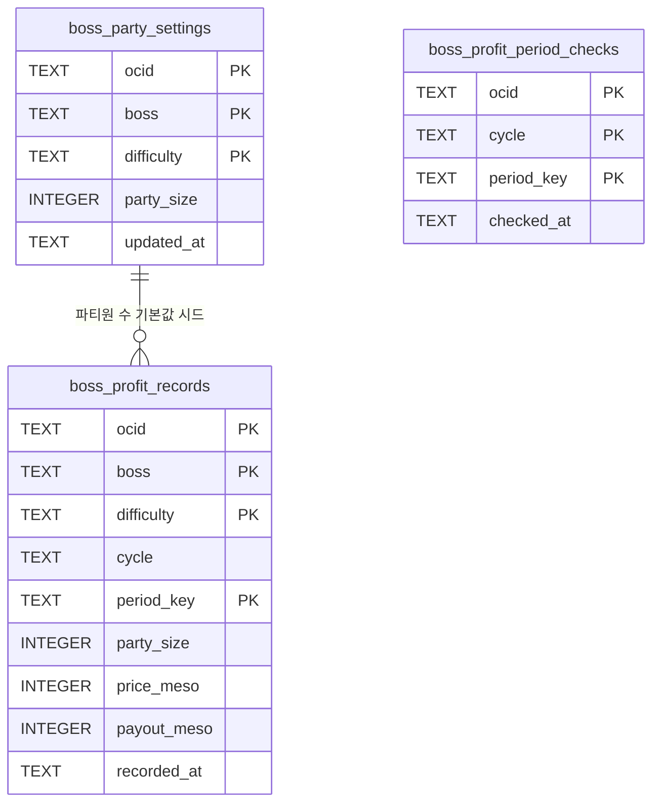
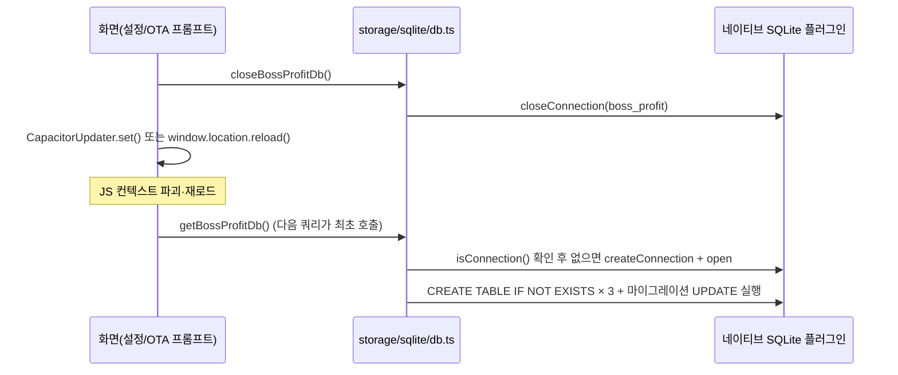

# SQLite — `boss_profit.db`

`@capacitor-community/sqlite` 기반 단일 DB(`storage/sqlite/db.ts`). 보스 수익 관련 3개 테이블만 여기에 있고, 나머지 데이터는 모두 [Preferences](./preferences.md)다 — "복합키로 upsert/조회가 잦은 기록형 데이터"만 관계형으로 뒀다.

## 스키마



> FOREIGN KEY 제약은 실제로 걸려 있지 않다 — 위 관계는 앱 코드가 `(ocid, boss, difficulty)`로 논리적으로 조인하는 것뿐이다(`features/boss-profit/store.ts`가 완료 감지 시 `boss_party_settings`를 먼저 조회해 `boss_profit_records`의 기본 파티원 수로 쓴다).

## 테이블별 역할

### `boss_profit_records` — 기간별 수익 기록
PK: `(ocid, boss, difficulty, period_key)`. 캐릭터가 특정 (보스, 난이도)를 특정 기간(`period_key`, 예: 주차)에 처치했을 때의 파티원 수·정가·실수령액 스냅샷.

- **자동 생성**: 사용자가 화면에 들어오지 않아도, 스케줄러 동기화 응답에서 `complete_flag: true`인 (ocid, boss, difficulty, periodKey) 조합을 처음 만나는 순간 즉시 upsert된다([[ADR-014]]).
- **로컬 전용**: Nexon API는 최근 14일치만 조회 가능하므로, 장기 히스토리는 이 테이블에만 존재한다 — 삭제하면 서버 재동기화로도 복구 불가.
- **파티원 수 기본값**: `boss_party_settings`에 같은 (ocid, boss, difficulty) 설정이 있으면 그 값을, 없으면 1(솔로)을 시딩한다([[ADR-019]]).

### `boss_party_settings` — 상시 파티 인원 설정
PK: `(ocid, boss, difficulty)`. "이 캐릭터는 이 보스를 항상 N인 파티로 잡는다"는 사용자 설정. 완료 여부·기간과 무관한 상시 값이며, 보스 스케줄러 화면의 파티 배지·솔로/파티 필터와 보스 수익 계산기가 공유한다.

- 삭제 API가 따로 없다 — 솔로로 되돌리려면 `party_size = 1`로 upsert한다("파티 관리" 설정과 솔로 취급이 값 레벨에서는 동일).

### `boss_profit_period_checks` — 기간 재조회 여부 마킹
PK: `(ocid, cycle, period_key)`. "이 캐릭터의 이 기간은 이미 (재)조회해서 로컬에 반영했다"는 마킹 전용 테이블 — 컬럼 자체에는 수익 정보가 없다.

- 보스 수익 화면의 기간 네비게이터가 과거로 이동할 때, 이 테이블에 체크 기록이 없는 기간만 `nexon/schedule`을 `date` 파라미터로 1회 재조회한다([[ADR-023]]). 한 번 체크되면 그 기간은 다시 재조회하지 않고 로컬 기록만 신뢰한다.

## 커넥션 라이프사이클과 운영상 주의사항

`getBossProfitDb()`가 모듈 스코프에서 커넥션을 싱글턴으로 캐싱한다(`storage/sqlite/db.ts`). 아래 두 시점 모두 **JS 컨텍스트를 파괴하고 리로드**하는 이벤트라, 리로드 직전에 반드시 `closeBossProfitDb()`로 커넥션을 먼저 정상 종료해야 한다 — 그러지 않으면 네이티브 쪽에 stale 커넥션이 남아 리로드 후 첫 쿼리가 응답 없이 멈춘다(앱 업데이트 직후 과거 수익 데이터가 안 불러와지는 증상으로 2026-07-17 실사용자 보고, `storage/sqlite/db.ts`의 `closeBossProfitDb` 주석 참고).



이 패턴을 쓰는 두 곳:
- `native/live-update.ts`의 `applyDownloadedLiveUpdate()` — OTA 번들 적용 직전
- `app/settings/CacheDataSection.tsx`의 `handleClear()` — 캐시 데이터 삭제 직후 리로드 직전

## 마이그레이션

`openBossProfitDb()`가 커넥션을 열 때마다(앱 실행마다) 다음 두 UPDATE 문을 함께 실행한다. 조건에 걸리는 행이 이미 없으면 매번 실행해도 안전한 no-op이다.

```sql
UPDATE boss_party_settings SET boss = '시즌 보스 메이린' WHERE boss = '메이린';
UPDATE boss_profit_records SET boss = '시즌 보스 메이린' WHERE boss = '메이린';
```

메이린의 표시명을 Nexon API 응답(`content_name: "시즌 보스 메이린"`)과 통일하며 보스 식별 키가 바뀐 데이터를 옛 키에서 새 키로 옮겨, 기존에 저장된 파티 설정·수익 기록이 고아 데이터가 되지 않게 한다(2026-07-22).

## 웹 플랫폼

`Capacitor.getPlatform() === 'web'`이면 `connection.initWebStore()`를 먼저 호출해 웹 스토리지 백엔드를 초기화한다(개발 서버 `npm run dev`에서 SQLite를 흉내 내는 경로). 실기기(iOS/Android)에서는 이 호출을 건너뛰고 네이티브 SQLite를 바로 연다.
