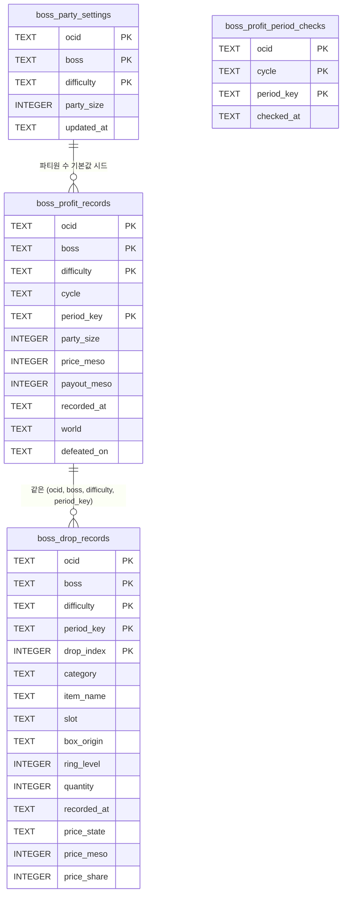
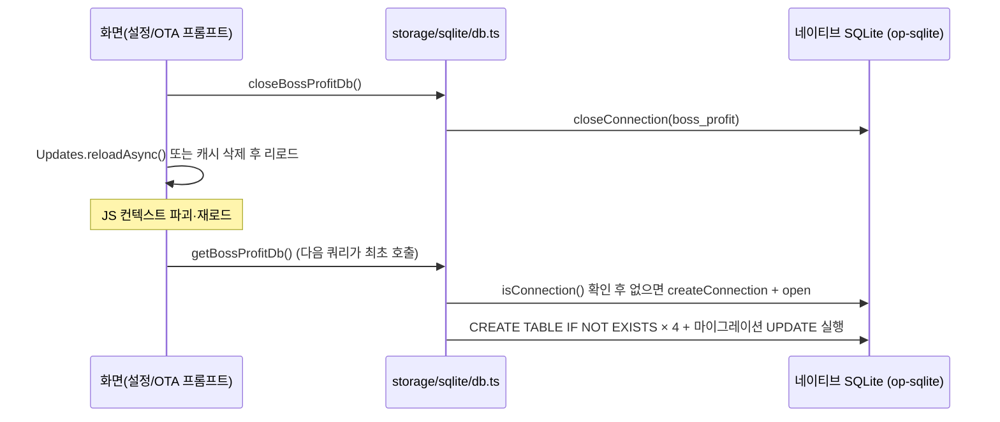

# SQLite — `boss_profit.db`

**`@op-engineering/op-sqlite`** 기반 단일 DB(`storage/sqlite/db.ts` + 어댑터 `storage/adapters/rn-sqlite.ts`). 보스 수익 관련 4개 테이블 + **가계부가 손으로 적는 둘**(`income_records`·`spend_records` — [[ADR-170]]·[[ADR-166]])이 여기에 있고, 나머지 데이터는 모두 [Preferences](./preferences.md)다 — "복합키로 upsert/조회가 잦은 기록형 데이터"만 관계형으로 뒀다. 손입력 둘은 **대리키**(`id`)라는 점에서 앞의 넷과 갈리고, 정책은 [features/cashbook.md](../features/cashbook.md) 가 든다.

> **파일 자리는 캐패시터 시절 그대로다.** op-sqlite 를 고른 이유는 성능이 아니라 `location` 이다 —
> 기존 DB 가 캐패시터 플러그인이 정한 경로에 있고, 자기 전용 디렉터리에만 파일을 만드는 라이브러리로는
> 거기 닿을 수 없다(닿지 못하면 빈 DB 가 새로 생기고 사용자에게는 기록이 전부 사라진 것으로 보인다).
> 경로 계산은 `storage/adapters/capacitor-sqlite-open.ts` 가 공유한다([migration/data.md](../migration/data.md) 결정 2).

## 스키마


```mermaid
erDiagram
    boss_profit_records {
        TEXT ocid PK
        TEXT boss PK
        TEXT difficulty PK
        TEXT cycle
        TEXT period_key PK
        INTEGER party_size
        INTEGER price_meso
        INTEGER payout_meso
        TEXT recorded_at
        TEXT world
        TEXT defeated_on
    }
    boss_party_settings {
        TEXT ocid PK
        TEXT boss PK
        TEXT difficulty PK
        INTEGER party_size
        TEXT updated_at
    }
    boss_profit_period_checks {
        TEXT ocid PK
        TEXT cycle PK
        TEXT period_key PK
        TEXT checked_at
    }
    boss_drop_records {
        TEXT ocid PK
        TEXT boss PK
        TEXT difficulty PK
        TEXT period_key PK
        INTEGER drop_index PK
        TEXT category
        TEXT item_name
        TEXT slot
        TEXT box_origin
        INTEGER ring_level
        INTEGER quantity
        TEXT recorded_at
        TEXT price_state
        INTEGER price_meso
        INTEGER price_share
    }
    boss_party_settings ||--o{ boss_profit_records : "파티원 수 기본값 시드"
    boss_profit_records ||--o{ boss_drop_records : "같은 (ocid, boss, difficulty, period_key)"
```

> FOREIGN KEY 제약은 실제로 걸려 있지 않다 — 위 관계는 앱 코드가 `(ocid, boss, difficulty)`(파티 설정) / `(ocid, boss, difficulty, period_key)`(드롭 기록)로 논리적으로 조인하는 것뿐이다(`features/boss-profit/store.ts`가 완료 감지 시 `boss_party_settings`를 먼저 조회해 `boss_profit_records`의 기본 파티원 수로 쓴다). 제약이 없으므로 **한쪽만 지우면 고아 행이 남는다** — 캐시 삭제가 네 테이블을 함께 비워야 하는 이유다([[ADR-052]]).

## 테이블별 역할

### `boss_profit_records` — 기간별 수익 기록
PK: `(ocid, boss, difficulty, period_key)`. 캐릭터가 특정 (보스, 난이도)를 특정 기간(`period_key`, 예: 주차)에 처치했을 때의 파티원 수·정가·실수령액 스냅샷.

- **자동 생성**: 사용자가 화면에 들어오지 않아도, 스케줄러 동기화 응답에서 `complete_flag: true`인 (ocid, boss, difficulty, periodKey) 조합을 처음 만나는 순간 즉시 upsert된다([[ADR-014]]).
- **로컬 전용**: Nexon API는 최근 14일치만 조회 가능하므로, 장기 히스토리는 이 테이블에만 존재한다 — 삭제하면 서버 재동기화로도 복구 불가.
- **파티원 수 기본값**: `boss_party_settings`에 같은 (ocid, boss, difficulty) 설정이 있으면 그 값을, 없으면 1(솔로)을 시딩한다([[ADR-019]]).
- **`world` = 기록 시점의 월드 스냅샷**([[ADR-069]] 결정 1, nullable). 월드 리프가 **과거 주의 결정석 귀속을 소급 이동**시키는 것을 막는다 — 전에는 화면이 라이브 캐시(`getCachedCharacterBasic`)의 월드를 썼다. `NULL`은 "월드 모름"이고 월드별 집계에서 조용히 빠진다([[ADR-054]] 결정 5). 나중에 추가된 컬럼이라 이미 만들어진 DB에는 `CREATE TABLE IF NOT EXISTS`가 손대지 않는다 — `db.ts`의 `ensureColumn`이 `PRAGMA table_info`로 확인하고 없을 때만 `ALTER TABLE ... ADD COLUMN` 한다(SQLite에 `ADD COLUMN IF NOT EXISTS`가 없다).
- **읽기 원천 규칙**: 기록이 있으면 `record.world`, 없으면(현재 기간의 미완료 placeholder) 캐시.
- **`defeated_on` = 처치 **날짜** (KST `YYYY-MM-DD`, nullable — [[ADR-172]]).** `period_key` 는 주(목요일)·달이라 «며칟날» 을 못 든다. 이 칸이 그것을 들고, **가계부 캘린더만** 읽는다. 값은 스케줄러 API 의 날짜별 응답을 훑어 «미완료 → 완료» 로 뒤집힌 날을 찾아 채운다(`features/boss-profit/defeat-dates.ts`). **NULL 은 «모름» 이고 월간 칸 집계에서 조용히 빠진다** — `world` 와 같은 모양이다([[ADR-069]] 결정 1). `world` 와 마찬가지로 나중에 더한 컬럼이라 **`ensureColumn` 이 함께 있어야 한다.** 키가 아니므로 옛 행을 옮기지 않는다.

### `boss_party_settings` — 상시 파티 인원 설정
PK: `(ocid, boss, difficulty)`. "이 캐릭터는 이 보스를 항상 N인 파티로 잡는다"는 사용자 설정. 완료 여부·기간과 무관한 상시 값이며, 보스 스케줄러 화면의 파티 배지·솔로/파티 필터와 보스 수익 계산기가 공유한다.

- 삭제 API가 따로 없다 — 솔로로 되돌리려면 `party_size = 1`로 upsert한다("파티 관리" 설정과 솔로 취급이 값 레벨에서는 동일).

### `boss_profit_period_checks` — 기간 재조회 여부 마킹
PK: `(ocid, cycle, period_key)`. "이 캐릭터의 이 기간은 이미 (재)조회해서 로컬에 반영했다"는 마킹 전용 테이블 — 컬럼 자체에는 수익 정보가 없다.

- 보스 수익 화면의 기간 네비게이터가 과거로 이동할 때, 이 테이블에 체크 기록이 없는 기간만 `nexon/schedule`을 `date` 파라미터로 1회 재조회한다([[ADR-023]]). 한 번 체크되면 그 기간은 다시 재조회하지 않고 로컬 기록만 신뢰한다.

### `boss_drop_records` — 기간별 드롭 기록
PK: `(ocid, boss, difficulty, period_key, drop_index)`. [[ADR-038]]에서 도입했다. **PK에 난이도가 들어 있어 처치 난이도가 나중에 확정·변경되면 이관이 필요하다**([[ADR-069]] 결정 4 — 옛 난이도 키의 드롭을 확정 키로 옮기고 그 난이도에서 획득 불가한 항목은 삭제한다. 상세는 [../features/boss-profit.md](../features/boss-profit.md) "자동 기록"). 한 보스가 여러 드롭을 가지므로 `drop_index`로 **같은 (보스, 난이도, 기간)에 여러 행**이 들어간다 — 위 세 테이블처럼 조합당 1행이 아니다.

- **금액을 저장한다 — 기록 한 건에 붙는 실판매가다**([[ADR-124]] 결정 1·4, 이슈 #185). `price_state`(`'entered'`·`'skipped'`·`NULL`=미입력) · `price_meso`(판매 **총액**, 수량이 2 이상이어도 묶음가 하나) · `price_share`(분배 인원 **스냅샷**). **상태를 금액의 유무로 추론하지 않는다** — 스킵과 미입력이 둘 다 "금액 없음"이라 구분이 사라진다. `slot`·`box_origin`·`ring_level`도 nullable이다(해당 카테고리가 아닌 드롭에는 값이 없다).
- **⚠️ `RecordedDrop` 변환기가 **셋**이다** — `lib/boss-drops.ts`·`features/boss-profit/rows.ts`의 동명 함수 `toRecordedDrop` 둘, 그리고 `drops-loader.ts` `loadDropsByRowKey`(이제 `toRecordedDrop` 에 위임). 새 컬럼을 여기 더하지 않으면 **타입 에러 없이 통과하고 값만 조용히 사라진다** — [[ADR-124]] 구현 중 세 번째를 놓쳐 "기간을 왕복하면 가격이 사라지는" 버그가 났다(인라인 리터럴이라 이름으로 못 찾았다). 컬럼을 늘릴 땐 **이름이 아니라 `RecordedDrop` 을 만드는 자리**를 훑을 것.
- **가격을 이 테이블에 둔 이유**([[ADR-124]] 결정 4): 난이도 확정 이관이 행을 통째로 옮기므로 가격이 **따라가고**, `pruneUnobtainableDrops` 탈락분의 가격이 **함께 사라지며**, 히스토리의 "원천은 이 테이블 하나"([[ADR-071]] 결정 1)가 유지된다. 가격 전용 테이블이면 셋 다 별도 코드가 된다.
- **⚠️ `recorded_at`은 "언제 먹었는가"가 아니다 — 감사 필드다**([[ADR-071]] 결정 2). `replaceBossDropRecords`가 DELETE→INSERT로 그룹을 통째로 교체하며 **그룹 전체 행에 호출 시점을 박고**, `pruneUnobtainableDrops` 정리와 난이도 확정 이관도 `now`로 덮는다. 그래서 같은 (보스, 난이도, 기간)에 드롭 하나를 더 추가하면 기존 드롭들의 `recorded_at`까지 오늘로 갱신된다. **드롭이 일어난 시점을 알아야 하면 `period_key`를 쓴다**(주간=리셋일 `YYYY-MM-DD`, 월간=`YYYY-MM`, 불변). 시간순 정렬도 `period_key DESC, drop_index`이고 `recorded_at DESC`는 과거 기간 재편집 한 번에 순서가 뒤집힌다.
- **고가 여부는 저장하지 않는다.** `isValuableDrop`(`lib/valuable-drops`)은 표시 시점 판정이라, 이 테이블에는 **선택 등록 가능한 모든 아이템**이 구분 없이 들어 있다 — 드롭 히스토리가 별도 테이블 없이 이 테이블만 읽는 근거다([[ADR-071]] 결정 1).
- **날짜 컬럼이 없다 — 짝인 수익 행의 `defeated_on` 을 물려받는다**([[ADR-172]] 결정 6). «먹은 날» 이 맞는 축이고([[ADR-170]] 결정 4 ④), 두 벌로 박으면 갈라질 수 있는 값이 하나 는다. 수익 행이 없는 드롭(결정석 가격을 모르는 보스)은 물려받을 것이 없어 NULL 이다.
- **`boss_profit_records`와 짝을 이룬다**(같은 `(ocid, boss, difficulty, period_key)`). FK가 없으므로 수익 기록만 지우고 이걸 남기면 고아 행이 되고, 같은 보스를 같은 기간에 다시 처치하면 예전 드롭이 되살아나 붙는다([[ADR-052]]).

## 새 테이블을 추가할 때

**`storage/sqlite/db.ts`의 테이블 정의 배열(`[{ name, createSql }]`)에만 넣으면 스키마 생성·캐시 삭제 범위·용량 계산에 자동 반영된다** — 삭제 목록을 따로 관리하는 곳은 없다([[ADR-052]] 결정 2). `openBossProfitDb()`의 `CREATE TABLE` 실행과 `storage/cache-data.ts`의 `DELETE FROM`/용량 합산이 모두 이 배열 하나를 본다. 자세한 삭제 범위는 [lifecycle.md](./lifecycle.md)의 "삭제 범위: 연결 해제 vs 캐시 데이터 삭제" 참고.

> 이 규칙이 생기기 전에는 `cache-data.ts`가 테이블 이름을 하드코딩한 별도 목록을 들고 있어, 나중에 추가된 `boss_drop_records`가 거기 빠진 채로 남았다(이 문서에도 같은 누락이 있었다).

## 커넥션 라이프사이클과 운영상 주의사항

`getBossProfitDb()`가 모듈 스코프에서 커넥션을 싱글턴으로 캐싱한다(`storage/sqlite/db.ts`). 아래 두 시점 모두 **JS 컨텍스트를 파괴하고 리로드**하는 이벤트라, 리로드 직전에 반드시 `closeBossProfitDb()`로 커넥션을 먼저 정상 종료해야 한다 — 그러지 않으면 네이티브 쪽에 stale 커넥션이 남아 리로드 후 첫 쿼리가 응답 없이 멈춘다(앱 업데이트 직후 과거 수익 데이터가 안 불러와지는 증상으로 2026-07-17 실사용자 보고, `storage/sqlite/db.ts`의 `closeBossProfitDb` 주석 참고).


```mermaid
sequenceDiagram
    participant UI as 화면(설정/OTA 프롬프트)
    participant DB as storage/sqlite/db.ts
    participant Native as 네이티브 SQLite (op-sqlite)

    UI->>DB: closeBossProfitDb()
    DB->>Native: closeConnection(boss_profit)
    UI->>UI: Updates.reloadAsync() 또는 캐시 삭제 후 리로드
    Note over UI: JS 컨텍스트 파괴·재로드
    UI->>DB: getBossProfitDb() (다음 쿼리가 최초 호출)
    DB->>Native: isConnection() 확인 후 없으면 createConnection + open
    DB->>Native: CREATE TABLE IF NOT EXISTS × 4 + 마이그레이션 UPDATE 실행
```

이 패턴을 쓰는 두 곳:
- `native/live-update.ts`의 `applyDownloadedLiveUpdate()` — OTA 번들 적용 직전
- `features/settings/cache-data.ts`의 `clearCacheDataAndReload()` — 캐시 데이터 삭제 직후 리로드 직전(호출 화면은 `app/settings/SettingsAccountDataScreen`. 옛 `app/settings/CacheDataSection.tsx` 는 2026-08-09 [[ADR-118]] 개편에서 삭제됐고, 닫기 호출은 그때도 이 파일에 있었다)

**닫기에는 5초 상한이 있고 여전히 던지지 않는다** ([[ADR-117]] 결정 5, 2026-08-08) — 여는 쪽 `withOpenTimeout`(10초)과 대칭이되 더 짧다(닫기는 파일 생성·마이그레이션이 없어 정상이면 수 ms). 상한이 없던 동안 이 호출은 **리로드 앞을 막는 유일한 맨몸 대기**였고, iOS 실기기 SQLite 무응답 전례가 둘이나 있는 상태에서(위 ADR-050 결정 2 · [[ADR-008]] 2026-07-17 정정) 그대로 매달리면 리로드에 도달하지 못한다. **타임아웃이 바꾸는 것은 *"실패로 끝난다"* 가 아니라 *"끝난다"*** 이고, 실패·타임아웃은 지금처럼 삼킨다(곧 리로드될 것이고 `openBossProfitDb` 의 stale 감지가 최후 폴백으로 남는다).

**두 곳 모두 커버(스플래시)보다 닫기가 먼저다** ([[ADR-117]] 결정 1·8) — 커버를 먼저 올리면 닫기가 매달리는 동안 사용자가 브랜드색 화면에 갇히고 iOS 에서는 터치까지 죽는다(이슈 #175).

### 커넥션 쪽 방어 — 우리가 못 끼워 넣는 경로가 있다 (⛔ ADR-050 결정 2·3, 지금도 유효)

위 두 곳은 **우리가 리로드를 일으키는** 경우다. 웹뷰 시절에는 그 밖에 앱이 통제할 수 없는 리로드 경로가
둘 있었고(두 손가락 동시 탭이 합성한 클릭이 `<a href>` 의 기본 동작을 흘린 것 · WebKit 콘텐츠 프로세스
사망 후 Capacitor 가 자동으로 걸던 `webView.reload()`), 거기엔 `closeBossProfitDb()` 를 끼워 넣을 자리가
없었다. **RN 에는 그 두 경로가 없다** — 문서도 웹뷰도 없다. 그런데도 **방어는 그대로 둔다**: 커넥션이
에러 없이 멈추는 사고(iOS 실기기 전례 둘)는 리로드와 무관하게 성립한다.

그래서 커넥션 쪽에도 방어가 있어야 한다 — `openBossProfitDb()`는 **타임아웃과 경쟁**시켜, 커넥션이 에러 없이 멈춰도 `dbPromise`를 비우고 다음 호출이 처음부터 다시 열게 한다(ADR-050 결정 2). 이 방어가 없으면 죽은 커넥션이 `dbPromise`에 영구 캐시되어 **앱을 재시작할 때까지** 모든 조회가 실패한다. 단 네이티브 브릿지 큐 자체가 막힌 경우엔 재시도 호출도 같은 큐에 서므로 회복되지 않는다.

**조회 실패를 "기록 없음"으로 오인하지 말 것** — `features/boss-profit/store.ts`의 `withSqliteFallback`은 타임아웃을 빈 결과로 바꾸는데, 그 값을 "기록이 없다"로 읽으면 자동 기록이 `party_size = 1`로 **사용자가 저장한 값을 덮어쓴다**. `getBossProfitRecords` 조회는 폴백을 `null`로 두어 실패와 빈 결과를 구분하고, 실패면 자동 기록을 건너뛴다(ADR-050 결정 3).

## 마이그레이션

`openBossProfitDb()`가 커넥션을 열 때마다(앱 실행마다) 돈다. **수단이 셋**이고, 셋 다 «이미 됐으면 아무 일도 안 한다» 는 성질을 갖는다.

| 수단 | 무엇을 바꾸나 | 어떻게 «이미 됐는가» 를 아나 |
|---|---|---|
| `ensureColumn` | 없는 **칸을 더한다** ([[ADR-069]] 결정 1) | `PRAGMA table_info` 에 그 이름이 있나 |
| **테이블 재작성** | 칸의 **모양을 바꾼다**(`NOT NULL` 을 뗀다 — [[ADR-176]]) | `PRAGMA table_info` 의 `notnull` |
| `UPDATE … WHERE` | **값을 옮긴다**(이름이 곧 값인 칸) | `WHERE` 에 걸리는 행이 없다 |

### 칸을 더한다 — `ensureColumn`

SQLite 에 `ADD COLUMN IF NOT EXISTS` 가 없으므로 `PRAGMA table_info` 로 있는지 보고 없을 때만 `ALTER TABLE … ADD COLUMN` 한다(`ALTER` 를 try/catch 로 삼키면 다른 원인의 실패까지 숨는다). **`CREATE TABLE IF NOT EXISTS` 는 이미 만들어진 테이블에 칸을 더해주지 않는다** — 테이블을 세운 커밋과 칸을 더한 커밋이 갈리면 그 사이에 앱을 켠 기기는 칸이 모자란 테이블을 들고 있고, INSERT 는 모든 칸을 적으므로 **그 기록이 하나도 안 적힌다**(`spend_records.form` 이 실제로 그랬다 — 2026-08-25 실기 재현).

### 칸의 모양을 바꾼다 — 테이블 재작성 ([[ADR-176]], 이슈 #265)

**`ALTER TABLE` 로는 기존 칸의 `NOT NULL` 을 못 뗀다.** `income_records.meso_amount` 가 그 자리였다 — 수입이 메소뿐이던 시절 `NOT NULL` 로 만들어졌는데([[ADR-170]] 결정 1), 정정 15 가 「기타」에 통화를 더하며 «메소로 번 것이 아니다» 를 `null` 로 적기 시작해 **메포·캐시 「기타」가 저장되지 않았다.** 그래서 한 트랜잭션 안에서 테이블을 다시 쓴다:

```sql
BEGIN;
CREATE TABLE income_records_rebuild ( … 지금의 스키마 … );
INSERT INTO income_records_rebuild (<옮길 칸>) SELECT <옮길 칸> FROM income_records;
DROP TABLE income_records;
ALTER TABLE income_records_rebuild RENAME TO income_records;
COMMIT;
```

만질 때 **반드시 지켜야 하는 것 넷**:

- **트랜잭션 밖으로 내지 말 것.** 「옛 테이블은 지워졌고 새 이름은 아직 없는」 상태가 파일에 남으면 그 기기의 수입 기록이 전부 사라진다. 던지면 `ROLLBACK` 하고 그대로 올려보낸다.
- **옮길 칸은 `PRAGMA table_info` 로 읽은 «옛 테이블이 실제로 가진 칸»** 이다. `SELECT *` 는 `ensureColumn` 이 **뒤에** 붙인 칸 때문에 순서가 어긋나 값이 에러 없이 옆 칸으로 옮겨 앉고(수수료가 메포가 된다), 지금 스키마의 칸 목록을 박아 두면 그 칸이 아직 없는 옛 기기에서 던진다.
- **`ensureColumn` 들보다 먼저** 돈다 — 재작성이 만드는 테이블은 지금의 DDL 전체라 칸이 이미 다 있다.
- **DDL 본문은 한 벌**을 두 자리(정상 생성 · 재작성)가 쓴다. 두 벌로 두면 재작성이 옛 스키마를 다시 만드는 날이 온다.

> **재작성이 생기면서 `CREATE TABLE` 문의 진실성이 처음으로 강제된다.** `ensureColumn` 만 있을 때는 CREATE 문이 낡아도 아무 일도 안 일어났고 — 실제로 통화 칸 셋([[ADR-170]] 정정 15)이 `ensureColumn` 에만 있고 CREATE 문에는 없는 채로 멀쩡히 돌았다 — 재작성이 그 테이블을 만들려는 순간에야 「칸이 없다」 로 드러난다. **이제 칸을 더할 때는 두 자리를 함께 고친다**: CREATE 문(새 설치 · 재작성)과 `ensureColumn`(기존 기기).

> **목으로는 못 잡는 결함이다.** 제약은 목이 흉내 내라고 배운 목록에 없다 — 그래서 `node:sqlite`(노드 내장, 새 의존성 0)로 `SqlitePort` 를 구현해 **진짜 엔진 위에서 한 번 태우는** 경로를 뒀다(`src/storage/sqlite/__tests__/`). 스키마 제약을 만질 때는 그 파일에 케이스를 더할 것.

### 값을 옮긴다 — `UPDATE … WHERE`

다음 UPDATE 문들을 함께 실행한다. 조건에 걸리는 행이 이미 없으면 매번 실행해도 안전한 no-op이다.

```sql
UPDATE boss_party_settings SET boss = '시즌 보스 메이린' WHERE boss = '메이린';
UPDATE boss_profit_records SET boss = '시즌 보스 메이린' WHERE boss = '메이린';
```

위 둘은 메이린의 표시명을 Nexon API 응답(`content_name: "시즌 보스 메이린"`)과 통일하며 보스 식별 키가 바뀐 데이터를 옛 키에서 새 키로 옮겨, 기존에 저장된 파티 설정·수익 기록이 고아 데이터가 되지 않게 한다(2026-07-22).

## 웹 플랫폼

~~`Capacitor.getPlatform() === 'web'`이면 `connection.initWebStore()`를 먼저 호출해 웹 스토리지 백엔드를 초기화한다(개발 서버에서 SQLite를 흉내 내는 경로)~~ — **웹 경로가 사라졌다**(RN 은 실기기·시뮬레이터뿐). 실기기(iOS/Android)에서는 이 호출을 건너뛰고 네이티브 SQLite를 바로 연다.
